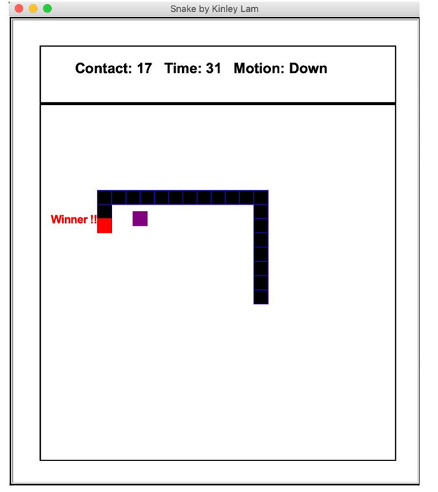

# 贪吃蛇

## 要求

### 对象：

一条蛇、一个怪物和 一些食物，由一组介于 1 和 9 之间的数字表示，头和尾巴分别以红色和黑色显示 ，而怪物则由 紫色方块显示。 数字是蛇吃的食物

### 界面：

  以下屏幕显示了蛇吃完所有食物后游戏的结局  包括完全伸展的尾巴;状态区域显示的是与怪物的接触次数  以及 以 秒为单位的总游戏时间



#### 画布：

上部状态区域 = 500 （宽） x 80 

#### 游戏状态  ：

 a. 显示蛇的运动（左、右、上、下、暂停），换句话说，最后一个  按下运动键（包括空格键），无论蛇是否在  运动或贝因G受阻。  

 b. 显示蛇与怪物的身体接触总数。 计数应  基于怪物计时器的运动。 每次重新定位怪物时，它  然后应该检查它是否与蛇的任何部分重叠。  

 c. 以 秒为单位跟踪经过的总游戏时间。  时间计数器尽快启动  因为游戏开始，只有在游戏结束时才会停止。 换句话说，计数器  当蛇被暂停时不会被阻止。  


### 规则：

#### 食物：

在随机位置显示运动区域内从 1 到 5 的 5 种食物。 这些  数字将始终保持可见，直到它们被蛇吞噬。 当  蛇头越过这些数字之一， 被划过的数字是  被视为已消耗，它将从游戏区域永久删除。 所以，任何  一种食物可以食用一次

一个单位长度，因此尾巴在 完全伸展时将由 5 个方形组成

####   怪物  ：

a、一个固定大小的物体，被编程为 向蛇移动，试图做出  正面碰撞。  

b. 启动时，将怪物放置在与蛇保持一定距离的随机位置。  

c. 怪物应该以随机的速度移动

#### 蛇： 

 在游戏开始时，尾巴的长度设置为 5。 一个正方形算作 

按下空格蛇暂停，怪物不暂停

### 游戏内核

####  通过定时器运动

 a. “计时器”是指特定事件以固定间隔发生的频率，在  在这种情况下，事件是蛇或怪物的运动。 

 b. 使用 单独的 计时器手动刷新蛇和怪物的移动  一. 关闭 内置的自动屏幕刷新  

c. 设置适当的计时器速率，例如不超过 0.2 秒


#### 模块

  仅使用标准 python 模块

## 制作思路

界面：turtle

定时器：time

随机数：random

## 学习路线

### 界面

使用turtle，找看看turtle的刷新机制

划分游戏区域、游戏状态、边缘

turtle 键盘监听

### 对象与动作构建

创建蛇、怪物、食物类

### turtle用到的方法

[Python中的turtle.onkey()函数|极客教程 (geek-docs.com)](https://geek-docs.com/python-turtle/python-turtle-python-turtle/turtle-onkey-function-in-python.html)

turtle .ontimer()

## 历史版本

### 类封装成功

```python
import turtle
import time
import random
# global x, y
class Snake():
    def __init__(self):
        self.head = turtle.Turtle()
        self.head.shape("square")
        self.head.color("white")
        self.head.penup()
        self.head.goto(0, 0)
        self.head.direction = "Stop"
        # self.keylisten()
        self.x = 0
        self.y = 0
    def group(self):
        if self.head.direction != "down":
            self.head.direction = "up"

    def godown(self):
        if self.head.direction != "up":
            self.head.direction = "down"

    def goleft(self):
        if self.head.direction != "right":
            self.head.direction = "left"

    def goright(self):
        if self.head.direction != "left":
            self.head.direction = "right"

    def move(self):
        if self.head.direction == "up":
            self.y = self.head.ycor()
            self.head.sety(self.y + 20)
        if self.head.direction == "down":
            self.y = self.head.ycor()
            self.head.sety(self.y - 20)
        if self.head.direction == "left":
            self.x = self.head.xcor()
            self.head.setx(self.x - 20)
        if self.head.direction == "right":
            self.x = self.head.xcor()
            self.head.setx(self.x + 20)
        print(self.x,self.y)
class Food():
    # food in the game
    def __init__(self):
        self.food = turtle.Turtle()
        self.colors = random.choice(['red', 'green', 'black'])
        self.shapes = random.choice(['square', 'triangle', 'circle'])
        self.food.speed(0)
        self.food.shape(self.shapes)
        self.food.color(self.colors)
        self.food.penup()
        self.food.goto(0, 100)
        self.x = 0
        self.y = 100
class Pen():
    def __init__(self):
        self.pen = turtle.Turtle()
        self.pen.speed(0)
        self.pen.shape("square")
        self.pen.color("white")
        self.pen.penup()
        self.pen.hideturtle()
        self.pen.goto(0, 250)
        self.pen.write("Score : 0  High Score : 0", align="center",
                  font=("candara", 24, "bold"))

class Game():
    def __init__(self):
        self.score = 0
        self.delay = 0.1
        self.high_score = 0
        # self.x = 0
        # self.y = 0
        self.wn = turtle.Screen()##画笔对象
        self.segments = []
        self.wn = turtle.Screen()
        self.wn.title("Snake Game")
        self.wn.bgcolor("blue")
        # the width and height can be put as user's choice
        self.wn.setup(width=600, height=600)
        self.wn.tracer(0)
        self.snake = Snake()#蛇对象
        self.pen1 = Pen()
        self.food1 = Food()
        self.keylisten()#设置监听
        self.Game_Start()

    def keylisten(self):
        self.wn.listen()
        self.wn.onkeypress(self.snake.group, "w")
        self.wn.onkeypress(self.snake.godown, "s")
        self.wn.onkeypress(self.snake.goleft, "a")
        self.wn.onkeypress(self.snake.goright, "d")
    def Game_Start(self):
        # while True:
            # self.wn.ontimer(self,)
        self.wn.update()
        if self.snake.head.xcor() > 290 or self.snake.head.xcor() < -290 or self.snake.head.ycor() > 290 or self.snake.head.ycor() < -290:
            time.sleep(1)
            self.snake.head.goto(0, 0)
            self.snake.head.direction = "Stop"
            self.snake.colors = random.choice(['red', 'blue', 'green'])
            self.snake.shapes = random.choice(['square', 'circle'])
            for segment in self.segments:
                segment.goto(1000, 1000)
            self.segments.clear()
            self.score = 0
            self.delay = 0.1
            self.pen1.pen.clear()
            self.pen1.pen.write("Score : {} High Score : {} ".format(self.score, self.high_score), align="center",
                                font=("candara", 24, "bold"))
        if self.snake.head.distance(self.food1.food) < 20:
            x = random.randint(-270, 270)
            y = random.randint(-270, 270)
            self.food1.food.goto(x, y)
            # Adding segment
            new_segment = turtle.Turtle()
            new_segment.speed(0)
            new_segment.shape("square")
            new_segment.color("orange")  # tail colour
            new_segment.penup()
            self.segments.append(new_segment)
            self.delay -= 0.001
            self.score += 10
            if self.score > self.high_score:
                self.high_score = self.score
            self.pen1.pen.clear()
            self.pen1.pen.write("Score : {} High Score : {} ".format(
                self.score, self.high_score), align="center", font=("candara", 24, "bold"))
        # Checking for head collisions with body segments
        for index in range(len(self.segments) - 1, 0, -1):
            x = self.segments[index - 1].xcor()
            y = self.segments[index - 1].ycor()
            self.segments[index].goto(x, y)
        if len(self.segments) > 0:
            x = self.snake.head.xcor()
            y = self.snake.head.ycor()
            self.segments[0].goto(x, y)
        self.snake.move()
        for segment in self.segments:
            if segment.distance(self.snake.head) < 20:
                time.sleep(1)
                self.snake.head.goto(0, 0)
                self.snake.head.direction = "stop"
                self.colors = random.choice(['red', 'blue', 'green'])
                self.shapes = random.choice(['square', 'circle'])
                for segment in self.segments:
                    segment.goto(1000, 1000)
                segment.clear()

                self.score = 0
                self.delay = 0.1
                self.pen1.pen.clear()
                self.pen1.pen.write("Score : {} High Score : {} ".format(
                    self.score, self.high_score), align="center", font=("candara", 24, "bold"))
        self.wn.ontimer(self.Game_Start  , 100)

if __name__ == "__main__":
    game = Game()
    game.wn.mainloop()
```

### 绘制边框+数字食物显示

```python
import turtle
import time
import random
# global x, y
class Snake():
    def __init__(self):

        self.head = turtle.Turtle()
        self.head.shape("square")
        self.head.color("red")
        self.head.penup()
        self.head.goto(0, 0)
        self.head.direction = "Stop"
        # self.keylisten()
        self.x = 0
        self.y = 0
    def group(self):
        if self.head.direction != "down":
            self.head.direction = "up"

    def godown(self):
        if self.head.direction != "up":
            self.head.direction = "down"

    def goleft(self):
        if self.head.direction != "right":
            self.head.direction = "left"

    def goright(self):
        if self.head.direction != "left":
            self.head.direction = "right"

    def move(self):
        if self.head.direction == "up":
            self.y = self.head.ycor()
            self.head.sety(self.y + 20)
        if self.head.direction == "down":
            self.y = self.head.ycor()
            self.head.sety(self.y - 20)
        if self.head.direction == "left":
            self.x = self.head.xcor()
            self.head.setx(self.x - 20)
        if self.head.direction == "right":
            self.x = self.head.xcor()
            self.head.setx(self.x + 20)
        # print(self.x,self.y)
class Food1():
    # food in the game
    def __init__(self):
        self.food = turtle.Turtle()
        self.colors = random.choice(['red', 'green', 'black'])
        self.shapes = random.choice(['square', 'triangle', 'circle'])
        self.food.speed(0)
        self.food.shape(self.shapes)
        self.food.color(self.colors)
        food.hideturtle()
        self.food.penup()
        self.food.goto(0, 100)
class Food():
    def __init__(self):
        self.num_array = ['1', '2', '3', '4', '5']
        self.num_str =random.choice(self.num_array)
        self.food = turtle.Turtle()
        self.food.speed(0)
        self.food.shape("square")
        self.food.color("black")
        self.food.penup()
        self.food.hideturtle()#隐藏笔迹
        self.food.goto(0, 100)
        self.food.write(self.num_str, align="center",
                  font=("candara", 24, "bold"))
        self.food_num = 5
        self.del_num()
    def del_num(self):
        ##关键代码，解决无法删除列表中某个值的问题
        if len(self.num_array)>0 :
            for i in reversed(range(len(self.num_array))):
                if self.num_array[i] == self.num_str:
                    del self.num_array[i]
                    # print(self.num_array[i])

class Pen():
    def __init__(self):
        self.pen = turtle.Turtle()
        self.pen.speed(0)
        self.pen.shape("square")
        self.pen.color("black")
        self.pen.penup()
        self.pen.hideturtle()#隐藏笔迹
        self.pen.goto(0, 210)
        self.pen.write("Score : 0  High Score : 0", align="center",
                  font=("candara", 24, "bold"))
        # self.pen.goto(0,210)
        # self.pen.forward(500)
class Pen1():
    def __init__(self):
        self.pen = turtle.Turtle()
        self.pen.speed(0)
        self.pen.shape("square")
        self.pen.color("black")
        self.pen.penup()
        self.pen.hideturtle()#隐藏笔迹
        self.pen.goto(-250, 210)
        self.pen.pendown()
        self.pen.forward(500)
        self.pen.right(90)
        self.pen.forward(500)
        self.pen.right(90)
        self.pen.forward(500)
        self.pen.right(90)
        self.pen.forward(580)
        self.pen.right(90)
        self.pen.forward(500)
        self.pen.right(90)
        self.pen.forward(580)
        # self.pen.goto(0,0)
        # self.pen.write("Score : 0  High Score : 0", align="center",
        #           font=("candara", 24, "bold"))
        # self.pen.goto(0,210)
        # self.pen.forward(500)
class Game():
    def __init__(self):
        self.score = 0
        self.delay = 0.1
        self.high_score = 0
        # self.x = 0
        # self.y = 0
        self.wn = turtle.Screen()##画笔对象
        self.segments = []
        self.wn = turtle.Screen()
        self.wn.title("Snake Game")
        self.wn.bgcolor("white")
        # the width and height can be put as user's choice
        self.wn.setup(width=580, height=660)
        self.wn.tracer(0)
        self.snake = Snake()#蛇对象
        self.pen1 = Pen()
        self.pen2 = Pen1()
        self.food1 = Food()
        self.keylisten()#设置监听
        self.Game_Start()

    def keylisten(self):
        self.wn.listen()
        self.wn.onkeypress(self.snake.group, "w")
        self.wn.onkeypress(self.snake.godown, "s")
        self.wn.onkeypress(self.snake.goleft, "a")
        self.wn.onkeypress(self.snake.goright, "d")

    # def erasableWrite(tortoise, name, font, align, reuse=None):
    #     eraser = turtle.Turtle() if reuse is None else reuse
    #     eraser.hideturtle()
    #     eraser.up()
    #     eraser.setposition(tortoise.position())
    #     eraser.write(name, font=font, align=align)
    #     return eraser
    def If_Over(self):
        if self.food1.food_num == 0 or  self.snake.head.xcor() > 250 or self.snake.head.xcor() < -250 or self.snake.head.ycor() > 210 or self.snake.head.ycor() < -290:
            time.sleep(1)
            self.snake.head.goto(0, 0)
            self.snake.head.direction = "Stop"
            # self.snake.colors = random.choice(['black', 'blue', 'green'])
            # self.snake.shapes = random.choice(['square', 'circle'])
            for segment in self.segments:
                segment.goto(1000, 1000)
            self.segments.clear()
            self.score = 0
            self.delay = 0.1
            self.pen1.pen.clear()
            self.pen1.pen.write("Score : {} High Score : {} ".format(self.score, self.high_score), align="center",
                                font=("Arial", 24, "bold"))
            self.food1.num_array = ['1', '2', '3', '4', '5']
            self.food1.food_num = 5
    def Game_Start(self):
        # while True:
            # self.wn.ontimer(self,)
        self.wn.update()
        ##游戏结束
        self.If_Over()
        if self.snake.head.distance(self.food1.food) < 20:
            self.food1.food.clear()
            self.food1.food_num -= 1
            print("food_num ",self.food1.food_num)
            self.If_Over()
            # print("food_num ",self.food1.food_num)
            x = random.randint(-250, 250)
            y = random.randint(-290, 210)
            self.food1.food.goto(x, y)
            self.food1.num_str= random.choice(self.food1.num_array)
            self.food1.del_num()
            self.food1.food.write(self.food1.num_str, align="center",
                            font=("candara", 24, "bold"))
            # Adding segment
            new_segment = turtle.Turtle()
            new_segment.speed(0)
            new_segment.shape("square")
            new_segment.color("black")  # tail colour
            new_segment.penup()
            self.segments.append(new_segment)
            self.delay -= 0.001
            self.score += 10
            if self.score > self.high_score:
                self.high_score = self.score
            self.pen1.pen.clear()
            self.pen1.pen.write("Score : {} High Score : {} ".format(
                self.score, self.high_score), align="center", font=("candara", 24, "bold"))
        # Checking for head collisions with body segments
        for index in range(len(self.segments) - 1, 0, -1):
            x = self.segments[index - 1].xcor()
            y = self.segments[index - 1].ycor()
            self.segments[index].goto(x, y)
        if len(self.segments) > 0:
            x = self.snake.head.xcor()
            y = self.snake.head.ycor()
            self.segments[0].goto(x, y)
        self.snake.move()
        for segment in self.segments:
            if segment.distance(self.snake.head) < 20:
                time.sleep(1)
                self.snake.head.goto(0, 0)
                self.snake.head.direction = "stop"
                self.colors = random.choice(['red', 'blue', 'green'])
                self.shapes = random.choice(['square', 'circle'])
                for segment in self.segments:
                    segment.goto(1000, 1000)
                segment.clear()

                self.score = 0
                self.delay = 0.1
                self.pen1.pen.clear()
                self.pen1.pen.write("Score : {} High Score : {} ".format(
                    self.score, self.high_score), align="center", font=("candara", 24, "bold"))

        self.wn.ontimer(self.Game_Start  , 100)

if __name__ == "__main__":
    game = Game()
    game.wn.mainloop()
```

### 状态显示

```python
import turtle
import time
import random
# global x, y
class Snake():
    def __init__(self):

        self.head = turtle.Turtle()
        self.head.shape("square")
        self.head.color("red")
        self.head.penup()
        self.head.goto(0, 0)
        self.head.direction = "Stop"
        # self.keylisten()
        self.x = 0
        self.y = 0
    def group(self):
        if self.head.direction != "down":
            self.head.direction = "up"

    def godown(self):
        if self.head.direction != "up":
            self.head.direction = "down"

    def goleft(self):
        if self.head.direction != "right":
            self.head.direction = "left"

    def goright(self):
        if self.head.direction != "left":
            self.head.direction = "right"

    def move(self):
        if self.head.direction == "up":
            self.y = self.head.ycor()
            self.head.sety(self.y + 20)
        if self.head.direction == "down":
            self.y = self.head.ycor()
            self.head.sety(self.y - 20)
        if self.head.direction == "left":
            self.x = self.head.xcor()
            self.head.setx(self.x - 20)
        if self.head.direction == "right":
            self.x = self.head.xcor()
            self.head.setx(self.x + 20)
        # print(self.x,self.y)
class Food():
    def __init__(self):
        self.num_array = ['1', '2', '3', '4', '5']
        self.num_str =random.choice(self.num_array)
        self.food = turtle.Turtle()
        self.food.speed(0)
        self.food.shape("square")
        self.food.color("black")
        self.food.penup()
        self.food.hideturtle()#隐藏笔迹
        self.food.goto(0, 100)
        self.food.write(self.num_str, align="center",
                  font=("candara", 24, "bold"))
        self.food_num = 5
        self.del_num()
    def del_num(self):
        ##关键代码，解决无法删除列表中某个值的问题
        if len(self.num_array)>0 :
            for i in reversed(range(len(self.num_array))):
                if self.num_array[i] == self.num_str:
                    del self.num_array[i]
                    # print(self.num_array[i])

class Pen():
    def __init__(self):
        self.pen = turtle.Turtle()
        self.pen.speed(0)
        self.pen.shape("square")
        self.pen.color("black")
        self.pen.penup()
        self.pen.hideturtle()#隐藏笔迹
        self.pen.goto(0, 210)
        self.pen.write("Score : 0  High Score : 0", align="center",
                  font=("candara", 24, "bold"))
        # self.pen.goto(0,210)
        # self.pen.forward(500)
class Pen1():
    def __init__(self):
        self.pen = turtle.Turtle()
        self.pen.speed(0)
        self.pen.shape("square")
        self.pen.color("black")
        self.pen.penup()
        self.pen.hideturtle()#隐藏笔迹
        self.pen.goto(-250, 210)
        self.pen.pendown()
        self.pen.forward(500)
        self.pen.right(90)
        self.pen.forward(500)
        self.pen.right(90)
        self.pen.forward(500)
        self.pen.right(90)
        self.pen.forward(580)
        self.pen.right(90)
        self.pen.forward(500)
        self.pen.right(90)
        self.pen.forward(580)
        # self.pen.goto(0,0)
        # self.pen.write("Score : 0  High Score : 0", align="center",
        #           font=("candara", 24, "bold"))
        # self.pen.goto(0,210)
        # self.pen.forward(500)
class Game():
    def __init__(self):
        self.starttime = time.time()
        self.endtime = time.time()
        self.score = 0
        self.delay = 0.1
        self.high_score = 0
        # self.x = 0
        # self.y = 0
        self.wn = turtle.Screen()##画笔对象
        self.segments = []
        self.wn = turtle.Screen()
        self.wn.title("Snake Game")
        self.wn.bgcolor("white")
        # the width and height can be put as user's choice
        self.wn.setup(width=580, height=660)
        self.wn.tracer(0)
        self.snake = Snake()#蛇对象
        self.pen1 = Pen()
        self.pen2 = Pen1()
        self.food1 = Food()
        self.keylisten()#设置监听
        self.Game_Start()

    def keylisten(self):
        self.wn.listen()
        self.wn.onkeypress(self.snake.group, "w")
        self.wn.onkeypress(self.snake.godown, "s")
        self.wn.onkeypress(self.snake.goleft, "a")
        self.wn.onkeypress(self.snake.goright, "d")

    # def erasableWrite(tortoise, name, font, align, reuse=None):
    #     eraser = turtle.Turtle() if reuse is None else reuse
    #     eraser.hideturtle()
    #     eraser.up()
    #     eraser.setposition(tortoise.position())
    #     eraser.write(name, font=font, align=align)
    #     return eraser

    def staus_upgrade(self):
        self.pen1.pen.clear()
        self.endtime = time.time()
        time_c = int(self.endtime - self.starttime)
        print(time_c)
        self.pen1.pen.write("Contact: {} Time: {} Motion {} ".format(
            self.score,time_c,self.snake.head.direction), align="center", font=("candara", 18, "bold"))

    def If_Over(self):
        if self.food1.food_num == 0 or  self.snake.head.xcor() > 250 or self.snake.head.xcor() < -250 or self.snake.head.ycor() > 210 or self.snake.head.ycor() < -290:
            time.sleep(1)
            self.snake.head.goto(0, 0)
            self.snake.head.direction = "Stop"
            # self.snake.colors = random.choice(['black', 'blue', 'green'])
            # self.snake.shapes = random.choice(['square', 'circle'])
            for segment in self.segments:
                segment.goto(1000, 1000)
            self.segments.clear()
            self.score = 0
            self.delay = 0.1
            self.pen1.pen.clear()
            self.pen1.pen.write("Contact: {} Time: {} Motion {} ".format(0, 0, 0), align="center",
                                font=("Arial", 24, "bold"))
            self.food1.num_array = ['1', '2', '3', '4', '5']
            self.food1.food_num = 5
            self.starttime = time.time()
            self.endtime = time.time()

    def Game_Start(self):
        # while True:
            # self.wn.ontimer(self,)
        self.wn.update()
        ##游戏结束
        self.If_Over()
        if self.snake.head.distance(self.food1.food) < 20:
            self.food1.food.clear()
            self.food1.food_num -= 1
            print("food_num ",self.food1.food_num)
            self.If_Over()
            # print("food_num ",self.food1.food_num)
            x = random.randint(-250, 250)
            y = random.randint(-290, 210)
            self.score += int(self.food1.num_str)
            if self.score > self.high_score:
                self.high_score = self.score
            self.food1.food.goto(x, y)
            self.food1.num_str= random.choice(self.food1.num_array)
            self.food1.del_num()
            self.food1.food.write(self.food1.num_str, align="center",
                            font=("candara", 24, "bold"))
            # Adding segment
            new_segment = turtle.Turtle()
            new_segment.speed(0)
            new_segment.shape("square")
            new_segment.color("black")  # tail colour
            new_segment.penup()
            self.segments.append(new_segment)
            self.delay -= 0.001
            self.staus_upgrade()
            # self.pen1.pen.clear()
            # self.endtime = time.time()
            # time_c = int(self.endtime - self.starttime)
            # print(time_c)
            # self.pen1.pen.write("Score : {} High Score : {} Time :{} ".format(
            #     self.score, self.high_score, time_c), align="center", font=("candara", 18, "bold"))
        # Checking for head collisions with body segments
        for index in range(len(self.segments) - 1, 0, -1):
            x = self.segments[index - 1].xcor()
            y = self.segments[index - 1].ycor()
            self.segments[index].goto(x, y)
        if len(self.segments) > 0:
            x = self.snake.head.xcor()
            y = self.snake.head.ycor()
            self.segments[0].goto(x, y)
        self.snake.move()
        for segment in self.segments:
            if segment.distance(self.snake.head) < 20:
                time.sleep(1)
                self.snake.head.goto(0, 0)
                self.snake.head.direction = "stop"
                self.colors = random.choice(['red', 'blue', 'green'])
                self.shapes = random.choice(['square', 'circle'])
                for segment in self.segments:
                    segment.goto(1000, 1000)
                segment.clear()
                self.score = 0
                self.delay = 0.1
                # self.staus_upgrade()
                # self.pen1.pen.clear()
                # self.endtime = time.time()
                # time_c = int(self.endtime-self.starttime)
                # print(time_c)
                # self.pen1.pen.write("Score : {} High Score : {}  Time: {}".format(
                #     self.score, self.high_score, time_c), align="center", font=("candara", 24, "bold"))
        self.staus_upgrade()
        self.wn.ontimer(self.Game_Start  , 100)

if __name__ == "__main__":

    game = Game()
    game.wn.mainloop()
```

### 长度更改 bug

```python
import turtle
import time
import random


# global x, y
class Snake():
    def __init__(self):

        self.head = turtle.Turtle()
        self.head.shape("square")
        self.head.color("red")
        self.head.penup()
        self.head.goto(0, 0)
        self.head.direction = "Stop"
        self.pre_direction = "Stop"
        # self.keylisten()
        self.x = 0
        self.y = 0

    def group(self):
        if self.head.direction != "down":
            self.head.direction = "up"

    def godown(self):
        if self.head.direction != "up":
            self.head.direction = "down"

    def goleft(self):
        if self.head.direction != "right":
            self.head.direction = "left"

    def goright(self):
        if self.head.direction != "left":
            self.head.direction = "right"

    def stop(self):
        self.pre_direction = self.head.direction
        if self.head.direction != "stop":
            self.head.direction = "stop"
            return
        if self.head.direction == "stop":
            self.head.direction = self.pre_direction
            return

    def move(self):
        if self.head.direction == "up":
            self.y = self.head.ycor()
            self.head.sety(self.y + 20)
        if self.head.direction == "down":
            self.y = self.head.ycor()
            self.head.sety(self.y - 20)
        if self.head.direction == "left":
            self.x = self.head.xcor()
            self.head.setx(self.x - 20)
        if self.head.direction == "right":
            self.x = self.head.xcor()
            self.head.setx(self.x + 20)
        # print(self.x,self.y)


class Food():
    def __init__(self):
        self.num_array = ['1', '2', '3', '4', '5']
        self.num_str = random.choice(self.num_array)
        self.food = turtle.Turtle()
        self.food.speed(0)
        self.food.shape("square")
        self.food.color("black")
        self.food.penup()
        self.food.hideturtle()  # 隐藏笔迹
        self.food.goto(0, 100)
        self.food.write(self.num_str, align="center",
                        font=("candara", 24, "bold"))
        self.food_num = 5
        self.del_num()

    def del_num(self):
        ##关键代码，解决无法删除列表中某个值的问题
        if len(self.num_array) > 0:
            for i in reversed(range(len(self.num_array))):
                if self.num_array[i] == self.num_str:
                    del self.num_array[i]
                    # print(self.num_array[i])


class Pen():
    def __init__(self):
        self.pen = turtle.Turtle()
        self.pen.speed(0)
        self.pen.shape("square")
        self.pen.color("black")
        self.pen.penup()
        self.pen.hideturtle()  # 隐藏笔迹
        self.pen.goto(0, 210)
        self.pen.write("Score : 0  High Score : 0", align="center",
                       font=("candara", 24, "bold"))
        # self.pen.goto(0,210)
        # self.pen.forward(500)


class Pen1():
    def __init__(self):
        self.pen = turtle.Turtle()
        self.pen.speed(0)
        self.pen.shape("square")
        self.pen.color("black")
        self.pen.penup()
        self.pen.hideturtle()  # 隐藏笔迹
        self.pen.goto(-250, 210)
        self.pen.pendown()
        self.pen.forward(500)
        self.pen.right(90)
        self.pen.forward(500)
        self.pen.right(90)
        self.pen.forward(500)
        self.pen.right(90)
        self.pen.forward(580)
        self.pen.right(90)
        self.pen.forward(500)
        self.pen.right(90)
        self.pen.forward(580)
        # self.pen.goto(0,0)
        # self.pen.write("Score : 0  High Score : 0", align="center",
        #           font=("candara", 24, "bold"))
        # self.pen.goto(0,210)
        # self.pen.forward(500)


class Game():
    def __init__(self):
        self.starttime = time.time()
        self.endtime = time.time()
        self.stop_flag = 0
        self.score = 0
        self.delay = 0.1
        self.high_score = 0
        # self.x = 0
        # self.y = 0
        self.wn = turtle.Screen()  ##画笔对象
        self.segments = []
        self.wn = turtle.Screen()
        self.wn.title("Snake Game")
        self.wn.bgcolor("white")
        # the width and height can be put as user's choice
        self.wn.setup(width=580, height=660)
        self.wn.tracer(0)
        self.snake = Snake()  # 蛇对象
        self.pen1 = Pen()
        self.pen2 = Pen1()
        self.food1 = Food()
        self.keylisten()  # 设置监听
        self.Game_Start()

    def keylisten(self):
        self.wn.listen()
        self.wn.onkeypress(self.snake.group, "w")
        self.wn.onkeypress(self.snake.godown, "s")
        self.wn.onkeypress(self.snake.goleft, "a")
        self.wn.onkeypress(self.snake.goright, "d")
        self.wn.onkeypress(self.stop, " ")
    def staus_upgrade(self):
        self.pen1.pen.clear()
        self.endtime = time.time()
        time_c = int(self.endtime - self.starttime)
        # print(time_c)
        self.pen1.pen.write("Contact: {} Time: {} Motion {} ".format(
            self.score, time_c, self.snake.head.direction), align="center", font=("candara", 18, "bold"))

    def If_Over(self):
        if self.food1.food_num == 0 or self.snake.head.xcor() > 250 or self.snake.head.xcor() < -250 or self.snake.head.ycor() > 210 or self.snake.head.ycor() < -290:
            time.sleep(1)
            self.snake.head.goto(0, 0)
            self.snake.head.direction = "Stop"
            # self.snake.colors = random.choice(['black', 'blue', 'green'])
            # self.snake.shapes = random.choice(['square', 'circle'])
            for segment in self.segments:
                segment.goto(1000, 1000)
            self.segments.clear()
            self.score = 0
            self.delay = 0.1
            self.pen1.pen.clear()
            self.pen1.pen.write("Contact: {} Time: {} Motion {} ".format(0, 0, 0), align="center",
                                font=("Arial", 24, "bold"))
            self.food1.num_array = ['1', '2', '3', '4', '5']
            self.food1.food_num = 5
            self.starttime = time.time()
            self.endtime = time.time()

    def stop(self):
        self.snake.stop()
        if self.stop_flag == 1:
            self.stop_flag = 0
            return
        if self.stop_flag == 0:
            self.stop_flag = 1
            return
    def food_eated(self):
        if self.snake.head.distance(self.food1.food) < 20:
            self.food1.food.clear()
            self.food1.food_num -= 1
            print("food_num ", self.food1.food_num)
            self.If_Over()
            # print("food_num ",self.food1.food_num)
            x = random.randint(-250, 250)
            y = random.randint(-290, 210)
            self.score += int(self.food1.num_str)
            # if self.score > self.high_score:
            #     self.high_score = self.score
            self.food1.food.goto(x, y)
            self.food1.num_str = random.choice(self.food1.num_array)
            self.food1.del_num()
            self.food1.food.write(self.food1.num_str, align="center",
                                  font=("candara", 24, "bold"))
            # Adding segment
            for i in range(int(self.food1.num_str)):
                new_segment = turtle.Turtle()
                new_segment.speed(0)
                new_segment.shape("square")
                new_segment.color(
                    "black")  # tail colour
                new_segment.penup()
                self.segments.append(new_segment)
            self.delay -= 0.001
            self.staus_upgrade()
    def Game_Start(self):
        # while True:
        # self.wn.ontimer(self,)
        self.wn.update()
        ##游戏结束
        self.If_Over()
        self.food_eated()
        if len(self.segments) > 0:
            x = self.snake.head.xcor()
            y = self.snake.head.ycor()             
            self.segments[0].goto(x, y)
        len(self.segments)
        for index in range(len(self.segments) - 1, 0, -1):
        # for index in range(0,len(self.segments)-1, 1):
            x = self.segments[index-1].xcor()
            y = self.segments[index-1].ycor()
            self.segments[index].goto(x, y)
        self.snake.move()
        # Checking for head collisions with body segments
        for segment in self.segments:
            if segment.distance(self.snake.head) < 20:
                time.sleep(1)
                self.snake.head.goto(0, 0)
                self.snake.head.direction = "stop"
                self.colors = random.choice(['red', 'blue', 'green'])
                self.shapes = random.choice(['square', 'circle'])
                for segment in self.segments:
                    segment.goto(1000, 1000)
                segment.clear()
                self.score = 0
                self.delay = 0.1
                # self.staus_upgrade()
                # self.pen1.pen.clear()
                # self.endtime = time.time()
                # time_c = int(self.endtime-self.starttime)
                # print(time_c)
                # self.pen1.pen.write("Score : {} High Score : {}  Time: {}".format(
                #     self.score, self.high_score, time_c), align="center", font=("candara", 24, "bold"))
        self.staus_upgrade()
        self.wn.ontimer(self.Game_Start, 100)


if __name__ == "__main__":
    game = Game()
    game.wn.mainloop()
```

### 怪物+长度bug

```python
import turtle
import time
import random

class Monster():
    def __init__(self):

        self.monster = turtle.Turtle()
        self.monster.shape("square")
        self.monster.color("purple")
        self.monster.penup()
        self.monster.goto(200, 200)
        self.monster.direction = "Stop"
        self.pre_direction = "Stop"
        self.monster.speed(1)
    def chase(self,head):
        x=head.xcor()
        y=head.ycor()
        x1=self.monster.xcor()
        y1=self.monster.ycor()
        if abs(y1-y) > abs(x1-x):
            if y1 < y:
                self.monster.sety(y1 + 20)
            else:
                self.monster.sety(y1 - 20)
        else:
            if x1 < x:
                self.monster.setx(x1 + 20)
            else:
                self.monster.setx(x1 - 20)
        # self.monster.ontimer(self.chase, 100)

# global x, y
class Snake():
    def __init__(self):

        self.head = turtle.Turtle()
        self.head.shape("square")
        self.head.color("red")
        self.head.penup()
        self.head.goto(0, 0)
        self.head.direction = "Stop"
        self.pre_direction = "Stop"
        # self.keylisten()
        self.x = 0
        self.y = 0

    def group(self):
        if self.head.direction != "down":
            self.head.direction = "up"

    def godown(self):
        if self.head.direction != "up":
            self.head.direction = "down"

    def goleft(self):
        if self.head.direction != "right":
            self.head.direction = "left"

    def goright(self):
        if self.head.direction != "left":
            self.head.direction = "right"

    def stop(self):
        self.pre_direction = self.head.direction
        if self.head.direction != "stop":
            self.head.direction = "stop"
            return
        if self.head.direction == "stop":
            self.head.direction = self.pre_direction
            return

    def move(self):
        if self.head.direction == "up":
            self.y = self.head.ycor()
            self.head.sety(self.y + 20)
        if self.head.direction == "down":
            self.y = self.head.ycor()
            self.head.sety(self.y - 20)
        if self.head.direction == "left":
            self.x = self.head.xcor()
            self.head.setx(self.x - 20)
        if self.head.direction == "right":
            self.x = self.head.xcor()
            self.head.setx(self.x + 20)
        # print(self.x,self.y)


class Food():
    def __init__(self):
        self.num_array = ['1', '2', '3', '4', '5']
        self.num_str = random.choice(self.num_array)
        self.food = turtle.Turtle()
        self.food.speed(0)
        self.food.shape("square")
        self.food.color("black")
        self.food.penup()
        self.food.hideturtle()  # 隐藏笔迹
        self.food.goto(0, 100)
        self.food.write(self.num_str, align="center",
                        font=("candara", 24, "bold"))
        self.food_num = 5
        self.del_num()

    def del_num(self):
        ##关键代码，解决无法删除列表中某个值的问题
        if len(self.num_array) > 0:
            for i in reversed(range(len(self.num_array))):
                if self.num_array[i] == self.num_str:
                    del self.num_array[i]
                    # print(self.num_array[i])


class Pen():
    def __init__(self):
        self.pen = turtle.Turtle()
        self.pen.speed(0)
        self.pen.shape("square")
        self.pen.color("black")
        self.pen.penup()
        self.pen.hideturtle()  # 隐藏笔迹
        self.pen.goto(0, 210)
        self.pen.write("Score : 0  High Score : 0", align="center",
                       font=("candara", 24, "bold"))
        # self.pen.goto(0,210)
        # self.pen.forward(500)


class Pen1():
    def __init__(self):
        self.pen = turtle.Turtle()
        self.pen.speed(0)
        self.pen.shape("square")
        self.pen.color("black")
        self.pen.penup()
        self.pen.hideturtle()  # 隐藏笔迹
        self.pen.goto(-250, 210)
        self.pen.pendown()
        self.pen.forward(500)
        self.pen.right(90)
        self.pen.forward(500)
        self.pen.right(90)
        self.pen.forward(500)
        self.pen.right(90)
        self.pen.forward(580)
        self.pen.right(90)
        self.pen.forward(500)
        self.pen.right(90)
        self.pen.forward(580)
        # self.pen.goto(0,0)
        # self.pen.write("Score : 0  High Score : 0", align="center",
        #           font=("candara", 24, "bold"))
        # self.pen.goto(0,210)
        # self.pen.forward(500)


class Game():
    def __init__(self):
        self.starttime = time.time()
        self.endtime = time.time()
        self.count = 3
        self.stop_flag = 0
        self.score = 0
        self.delay = 0.1
        self.high_score = 0
        # self.x = 0
        # self.y = 0
        self.wn = turtle.Screen()  ##画笔对象
        self.segments = []
        self.wn = turtle.Screen()
        self.wn.title("Snake Game")
        self.wn.bgcolor("white")
        # the width and height can be put as user's choice
        self.wn.setup(width=580, height=660)
        self.wn.tracer(0)
        self.snake = Snake()  # 蛇对象
        self.monster1 = Monster()
        self.pen1 = Pen()
        self.pen2 = Pen1()
        self.food1 = Food()
        self.keylisten()  # 设置监听
        self.Game_Start()

    def keylisten(self):
        self.wn.listen()
        self.wn.onkeypress(self.snake.group, "w")
        self.wn.onkeypress(self.snake.godown, "s")
        self.wn.onkeypress(self.snake.goleft, "a")
        self.wn.onkeypress(self.snake.goright, "d")
        self.wn.onkeypress(self.stop, " ")
    def staus_upgrade(self):
        self.pen1.pen.clear()
        self.endtime = time.time()
        time_c = int(self.endtime - self.starttime)
        # print(time_c)
        self.pen1.pen.write("Contact: {} Time: {} Motion {} ".format(
            self.score, time_c, self.snake.head.direction), align="center", font=("candara", 18, "bold"))

    def If_Over(self):
        if self.food1.food_num == 0 or self.snake.head.xcor() > 250 or self.snake.head.xcor() < -250 or self.snake.head.ycor() > 210 or self.snake.head.ycor() < -290:
            time.sleep(1)
            self.snake.head.goto(0, 0)
            self.snake.head.direction = "Stop"
            # self.snake.colors = random.choice(['black', 'blue', 'green'])
            # self.snake.shapes = random.choice(['square', 'circle'])
            for segment in self.segments:
                segment.goto(1000, 1000)
            self.segments.clear()
            self.score = 0
            self.delay = 0.1
            # self.pen1.pen.clear()
            self.pen1.pen.write("Contact: {} Time: {} Motion {} ".format(0, 0, 0), align="center",
                                font=("Arial", 24, "bold"))
            self.food1.food.clear()

            self.food1.num_array = ['1', '2', '3', '4', '5']
            self.food1.food_num = 5
            # x = random.randint(-230, 230)
            # y = random.randint(-270, 200)
            # self.food1.food.goto(x, y)
            # self.food1.num_str = random.choice(self.food1.num_array)
            # self.food1.del_num()
            # self.food1.food.write(self.food1.num_str, align="center",
            #                       font=("candara", 20, "bold"))
            self.starttime = time.time()
            self.endtime = time.time()

    def stop(self):
        self.snake.stop()
        if self.stop_flag == 1:
            self.stop_flag = 0
            return
        if self.stop_flag == 0:
            self.stop_flag = 1
            return
    def food_eated(self):
        if self.snake.head.distance(self.food1.food) < 20:
            self.food1.food.clear()
            self.food1.food_num -= 1
            print("food_num ", self.food1.food_num)
            self.If_Over()
            # print("food_num ",self.food1.food_num)
            self.score += int(self.food1.num_str)
            # if self.score > self.high_score:
            #     self.high_score = self.score
            # Adding segment
            if len(self.segments)>0:
                x = self.segments[len(self.segments) - 1].xcor()
                y = self.segments[len(self.segments) - 1].ycor()
            else :
                x = self.snake.head.xcor()
                y = self.snake.head.ycor()
            for i in range(int(self.food1.num_str)):
                new_segment = turtle.Turtle()
                new_segment.speed(0)
                new_segment.shape("square")
                # new_segment.color(
                #     "black")  # tail colour
                new_segment.color(random.choice(["green","red","blue","black","yellow"]))
                new_segment.penup()
                # new_segment.setx(x)
                # new_segment.sety(y)
                new_segment.goto(x,y)
                self.segments.append(new_segment)
            print("len seg", len(self.segments))
            x = random.randint(-230, 230)
            y = random.randint(-270, 200)
            self.food1.food.goto(x, y)
            self.food1.num_str = random.choice(self.food1.num_array)
            self.food1.del_num()
            self.food1.food.write(self.food1.num_str, align="center",
                                  font=("candara", 20, "bold"))
            self.delay -= 0.001
            self.staus_upgrade()
    def grow(self):
        ##身体第一块跑向头
        if len(self.segments) > 0:
            x = self.snake.head.xcor()
            y = self.snake.head.ycor()
            self.segments[0].goto(x, y)
        for index in range(len(self.segments)-1 , 0, -1):
            # for index in range(0,len(self.segments)-1, 1):
            x = self.segments[index - 1].xcor()
            y = self.segments[index - 1].ycor()
            self.segments[index].goto(x, y)
        if len(self.segments) > 0:
            x = self.snake.head.xcor()
            y = self.snake.head.ycor()
            self.segments[0].goto(x, y)
        #     time.sleep(0.001)
        # for index in range(0,len(self.segments) - 1, 1):
        #     # for index in range(0,len(self.segments)-1, 1):
        #     x = self.segments[index].xcor()
        #     y = self.segments[index].ycor()
        #     self.segments[index+1].goto(x, y)
        #     time.sleep(0.001)
            # self.snake.move()
    def chase(self):
        x= self.snake.head.xcor()
        y= self.snake.head.ycor()
        x1= self.monster1.monster.xcor()
        y1= self.monster1.monster.ycor()
        # if abs(y1-y) > abs(x1-x):
        #     if y1 < y:
        #         self.monster1.monster.sety(y1 + 20)
        #     else:
        #         self.monster1.monster.sety(y1 - 20)
        # else:
        #     if x1 < x:
        #         self.monster1.monster.setx(x1 + 20)
        #     else:
        #         self.monster1.monster.setx(x1 - 20)
        # self.wn.tracer(n=5, delay=0)
        if abs(y1-y) > abs(x1-x):
            if y1 < y:
                self.monster1.monster.seth(90)
                self.monster1.monster.forward(20)
            else:
                self.monster1.monster.seth(270)
                self.monster1.monster.forward(20)
        else:
            if x1 < x:
                self.monster1.monster.seth(0)
                self.monster1.monster.forward(20)
            else:
                self.monster1.monster.seth(180)
                self.monster1.monster.forward(20)
    def Game_Start(self):
        # while True:
        # self.wn.ontimer(self,)
        # self.monster1.chase(self.snake.head)

        # self.monster1.monster.speed(5)
        self.count -= 1
        if self.count == 0:
            self.count = 3
            self.chase()
        self.wn.update()
        ##游戏结束
        self.If_Over()
        self.food_eated()
        # len(self.segments)
        self.grow()
        self.snake.move()
        # Checking for head collisions with body segments
        for segment in self.segments:
            if segment.distance(self.snake.head) < 20:
                time.sleep(1)
                self.snake.head.goto(0, 0)
                self.snake.head.direction = "stop"
                self.colors = random.choice(['red', 'blue', 'green'])
                self.shapes = random.choice(['square', 'circle'])
                for segment in self.segments:
                    segment.goto(1000, 1000)
                segment.clear()
                self.score = 0
                self.delay = 0.1
                # self.staus_upgrade()
                # self.pen1.pen.clear()
                # self.endtime = time.time()
                # time_c = int(self.endtime-self.starttime)
                # print(time_c)
                # self.pen1.pen.write("Score : {} High Score : {}  Time: {}".format(
                #     self.score, self.high_score, time_c), align="center", font=("candara", 24, "bold"))
        self.staus_upgrade()
        self.wn.ontimer(self.Game_Start, 100)


if __name__ == "__main__":
    game = Game()
    game.wn.mainloop()
```

### 去除封装+长度bug

```python
import turtle
import time
import random

global monster,head,food,pen,pen1,num_array,food_num,wn,score,delay,num_str,count
## 怪物
monster = turtle.Turtle()
monster.shape("square")
monster.color("purple")
monster.penup()
monster.goto(200, 200)
monster.direction = "Stop"
pre_direction = "Stop"
monster.speed(1)

#蛇
head = turtle.Turtle()
head.shape("square")
head.color("red")
head.penup()
head.goto(0, 0)
head.direction = "Stop"
pre_direction = "Stop"
segments = []


#食物
num_array = ['1', '2', '3', '4', '5']
num_str = random.choice(num_array)
food = turtle.Turtle()
food.speed(0)
food.shape("square")
food.color("black")
food.penup()
food.hideturtle()  # 隐藏笔迹
food.goto(0, 100)
food.write(num_str, align="center",
             font=("candara", 24, "bold"))
food_num = 5
for i in reversed(range(len(num_array))):
    if num_array[i] == num_str:
        del num_array[i]


##b标题画笔
pen = turtle.Turtle()
pen.speed(0)
pen.shape("square")
pen.color("black")
pen.penup()
pen.hideturtle()  # 隐藏笔迹
pen.goto(0, 210)
pen.write("Score : 0  High Score : 0", align="center",
               font=("candara", 24, "bold"))
#画布画笔
pen1 = turtle.Turtle()
pen1.speed(0)
pen1.shape("square")
pen1.color("black")
pen1.penup()
pen1.hideturtle()  # 隐藏笔迹
pen1.goto(-250, 210)
pen1.pendown()
pen1.forward(500)
pen1.right(90)
pen1.forward(500)
pen1.right(90)
pen1.forward(500)
pen1.right(90)
pen1.forward(580)
pen1.right(90)
pen1.forward(500)
pen1.right(90)
pen1.forward(580)


#主窗体
starttime = time.time()
endtime = time.time()
count = 3
stop_flag = 0
score = 0
delay = 0.1
high_score = 0
# x = 0
# y = 0
wn = turtle.Screen()  ##画笔对象
segments = []
wn = turtle.Screen()
wn.title("Snake Game")
wn.bgcolor("white")
# the width and height can be put as user's choice
wn.setup(width=580, height=660)
wn.tracer(0)


##蛇
def group():
    if head.direction != "down":
        head.direction = "up"


def godown():
    global monster, head, food, pen, pen1, num_array, food_num, wn, score, delay, num_str, count
    if head.direction != "up":
        head.direction = "down"


def goleft():
    global monster, head, food, pen, pen1, num_array, food_num, wn, score, delay, num_str, count
    if head.direction != "right":
        head.direction = "left"


def goright():
    global monster, head, food, pen, pen1, num_array, food_num, wn, score, delay, num_str, count
    if head.direction != "left":
        head.direction = "right"


def stop():
    global monster, head, food, pen, pen1, num_array, food_num, wn, score, delay, num_str, count
    pre_direction = head.direction
    if head.direction != "stop":
        head.direction = "stop"
        return
    if head.direction == "stop":
        head.direction = pre_direction
        return
# 食物
def del_num():
    global monster, head, food, pen, pen1, num_array, food_num, wn, score, delay, num_str, count
    ##关键代码，解决无法删除列表中某个值的问题
    if len(num_array) > 0:
        for i in reversed(range(len(num_array))):
            if num_array[i] == num_str:
                del num_array[i]
                # print(num_array[i])
def move():
    global monster, head, food, pen, pen1, num_array, food_num, wn, score, delay, num_str, count
    if head.direction == "up":
        y = head.ycor()
        head.sety(y + 20)
    if head.direction == "down":
            y = head.ycor()
            head.sety(y - 20)
    if head.direction == "left":
            x = head.xcor()
            head.setx(x - 20)
    if head.direction == "right":
            x = head.xcor()
            head.setx(x + 20)
#设置监听
wn.listen()
wn.onkeypress(group, "w")
wn.onkeypress(godown, "s")
wn.onkeypress(goleft, "a")
wn.onkeypress(goright, "d")


def staus_upgrade():
    global monster, head, food, pen, pen1, num_array, food_num, wn, score, delay, num_str, count
    pen.clear()
    endtime = time.time()
    time_c = int(endtime - starttime)
    # print(time_c)
    pen.write("Contact: {} Time: {} Motion {} ".format(
        score, time_c, head.direction), align="center", font=("candara", 18, "bold"))


def If_Over():
    global monster, head, food, pen, pen1, num_array, food_num, wn, score, delay, num_str, count
    if food_num == 0 or head.xcor() > 250 or head.xcor() < -250 or head.ycor() > 210 or head.ycor() < -290:
        time.sleep(1)
        head.goto(0, 0)
        head.direction = "Stop"
        # colors = random.choice(['black', 'blue', 'green'])
        # shapes = random.choice(['square', 'circle'])
        for segment in segments:
            segment.goto(1000, 1000)
        segments.clear()
        score = 0
        delay = 0.1
        # pen1.pen.clear()
        pen.write("Contact: {} Time: {} Motion {} ".format(0, 0, 0), align="center",
                            font=("Arial", 24, "bold"))
        food.clear()

        num_array = ['1', '2', '3', '4', '5']
        food_num = 5

        starttime = time.time()
        endtime = time.time()


def food_eated():
    global monster, head, food, pen, pen1, num_array, food_num, wn, score, delay, num_str, count
    if head.distance(food) < 20:
        food.clear()
        food_num -= 1
        print("food_num ", food_num)
        If_Over()
        # print("food_num ",food_num)
        score += int(num_str)
        # if score > high_score:
        #     high_score = score
        # Adding segment
        if len(segments) > 0:
            x = segments[len(segments) - 1].xcor()
            y = segments[len(segments) - 1].ycor()
        else:
            x = head.xcor()
            y = head.ycor()
        for i in range(int(num_str)):
            new_segment = turtle.Turtle()
            new_segment.speed(0)
            new_segment.shape("square")
            # new_segment.color(
            #     "black")  # tail colour
            new_segment.color(random.choice(["green", "red", "blue", "black", "yellow"]))
            new_segment.penup()
            # new_segment.setx(x)
            # new_segment.sety(y)
            new_segment.goto(x, y)
            segments.append(new_segment)
        print("len seg", len(segments))
        x = random.randint(-230, 230)
        y = random.randint(-270, 200)
        food.goto(x, y)
        num_str = random.choice(num_array)
        del_num()
        food.write(num_str, align="center",
                              font=("candara", 20, "bold"))
        delay -= 0.001
        staus_upgrade()


def grow():
    global monster, head, food, pen, pen1, num_array, food_num, wn, score, delay, num_str, count
    ##身体第一块跑向头
    if len(segments) > 0:
        x = head.xcor()
        y = head.ycor()
        segments[0].goto(x, y)
    for index in range(len(segments) - 1, 0, -1):
        # for index in range(0,len(segments)-1, 1):
        x = segments[index - 1].xcor()
        y = segments[index - 1].ycor()
        segments[index].goto(x, y)
    if len(segments) > 0:
        x = head.xcor()
        y = head.ycor()
        segments[0].goto(x, y)
    #     time.sleep(0.001)
    # for index in range(0,len(segments) - 1, 1):
    #     # for index in range(0,len(segments)-1, 1):
    #     x = segments[index].xcor()
    #     y = segments[index].ycor()
    #     segments[index+1].goto(x, y)
    #     time.sleep(0.001)
    # move()


def chase():
    global monster, head, food, pen, pen1, num_array, food_num, wn, score, delay, num_str, count
    x = head.xcor()
    y = head.ycor()
    x1 = monster.xcor()
    y1 = monster.ycor()
    # if abs(y1-y) > abs(x1-x):
    #     if y1 < y:
    #         monster1.monster.sety(y1 + 20)
    #     else:
    #         .sety(y1 - 20)
    # else:
    #     if x1 < x:
    #         .setx(x1 + 20)
    #     else:
    #         .setx(x1 - 20)
    # wn.tracer(n=5, delay=0)
    if abs(y1 - y) > abs(x1 - x):
        if y1 < y:
            monster.seth(90)
            monster.forward(20)
        else:
            monster.seth(270)
            monster.forward(20)
    else:
        if x1 < x:
            monster.seth(0)
            monster.forward(20)
        else:
            monster.seth(180)
            monster.forward(20)


def Game_Start():
    global monster,head,food,pen,pen1,num_array,food_num,wn,score,delay,num_str,count
    # while True:
    # wn.ontimer()
    # .chase(head)

    # .speed(5)
    count -= 1
    if count == 0:
        count = 3
        chase()
    wn.update()
    ##游戏结束
    If_Over()
    food_eated()
    # len(segments)
    grow()
    move()
    # Checking for head collisions with body segments
    for segment in segments:
        if segment.distance(head) < 20:
            time.sleep(1)
            head.goto(0, 0)
            head.direction = "stop"
            colors = random.choice(['red', 'blue', 'green'])
            shapes = random.choice(['square', 'circle'])
            for segment in segments:
                segment.goto(1000, 1000)
            segment.clear()
            score = 0
            delay = 0.1
            # staus_upgrade()
            # pen1.pen.clear()
            # endtime = time.time()
            # time_c = int(endtime-starttime)
            # print(time_c)
            # pen1.pen.write("Score : {} High Score : {}  Time: {}".format(
            #     score, high_score, time_c), align="center", font=("candara", 24, "bold"))
    staus_upgrade()
    wn.ontimer(Game_Start, 100)


Game_Start()
wn.mainloop()
# if __name__ == "main":
#      Game_Start()
#      wn.mainloop()
```

### 解决长度bug

```python 
import turtle
import time
import random

global monster,head,food,pen,pen1,num_array,food_num,wn,score,delay,num_str,count,pre_x,pre_y
## 怪物
monster = turtle.Turtle()
monster.shape("square")
monster.color("purple")
monster.penup()
monster.goto(200, 200)
monster.direction = "Stop"
pre_direction = "Stop"
monster.speed(1)

#蛇
head = turtle.Turtle()
head.shape("square")
head.color("red")
head.penup()
head.goto(0, 0)
head.direction = "Stop"
pre_direction = "Stop"
segments = []


#食物
num_array = ['1', '2', '3', '4', '5']
num_str = random.choice(num_array)
food = turtle.Turtle()
food.speed(0)
food.shape("square")
food.color("black")
food.penup()
food.hideturtle()  # 隐藏笔迹
food.goto(0, 100)
food.write(num_str, align="center",
             font=("candara", 24, "bold"))
food_num = 5
for i in reversed(range(len(num_array))):
    if num_array[i] == num_str:
        del num_array[i]


##b标题画笔
pen = turtle.Turtle()
pen.speed(0)
pen.shape("square")
pen.color("black")
pen.penup()
pen.hideturtle()  # 隐藏笔迹
pen.goto(0, 210)
pen.write("Score : 0  High Score : 0", align="center",
               font=("candara", 24, "bold"))
#画布画笔
pen1 = turtle.Turtle()
pen1.speed(0)
pen1.shape("square")
pen1.color("black")
pen1.penup()
pen1.hideturtle()  # 隐藏笔迹
pen1.goto(-250, 210)
pen1.pendown()
pen1.forward(500)
pen1.right(90)
pen1.forward(500)
pen1.right(90)
pen1.forward(500)
pen1.right(90)
pen1.forward(580)
pen1.right(90)
pen1.forward(500)
pen1.right(90)
pen1.forward(580)


#主窗体
starttime = time.time()
endtime = time.time()
count = 3
stop_flag = 0
score = 0
delay = 0.1
high_score = 0
# x = 0
# y = 0
wn = turtle.Screen()  ##画笔对象
wn = turtle.Screen()
wn.title("Snake Game")
wn.bgcolor("white")
# the width and height can be put as user's choice
wn.setup(width=580, height=660)
wn.tracer(0)


##蛇
def group():
    if head.direction != "down":
        head.direction = "up"


def godown():
    global monster, head, food, pen, pen1, num_array, food_num, wn, score, delay, num_str, count
    if head.direction != "up":
        head.direction = "down"


def goleft():
    global monster, head, food, pen, pen1, num_array, food_num, wn, score, delay, num_str, count
    if head.direction != "right":
        head.direction = "left"


def goright():
    global monster, head, food, pen, pen1, num_array, food_num, wn, score, delay, num_str, count
    if head.direction != "left":
        head.direction = "right"


def stop():
    global monster, head, food, pen, pen1, num_array, food_num, wn, score, delay, num_str, count
    pre_direction = head.direction
    if head.direction != "stop":
        head.direction = "stop"
        return
    if head.direction == "stop":
        head.direction = pre_direction
        return
# 食物
def del_num():
    global monster, head, food, pen, pen1, num_array, food_num, wn, score, delay, num_str, count
    ##关键代码，解决无法删除列表中某个值的问题
    if len(num_array) > 0:
        for i in reversed(range(len(num_array))):
            if num_array[i] == num_str:
                del num_array[i]
                # print(num_array[i])
def move():
    global monster, head, food, pen, pen1, num_array, food_num, wn, score, delay, num_str, count
    if head.direction == "up":
        y = head.ycor()
        head.sety(y + 20)
    if head.direction == "down":
            y = head.ycor()
            head.sety(y - 20)
    if head.direction == "left":
            x = head.xcor()
            head.setx(x - 20)
    if head.direction == "right":
            x = head.xcor()
            head.setx(x + 20)
#设置监听
wn.listen()
wn.onkeypress(group, "w")
wn.onkeypress(godown, "s")
wn.onkeypress(goleft, "a")
wn.onkeypress(goright, "d")


def staus_upgrade():
    global monster, head, food, pen, pen1, num_array, food_num, wn, score, delay, num_str, count
    pen.clear()
    endtime = time.time()
    time_c = int(endtime - starttime)
    # print(time_c)
    pen.write("Contact: {} Time: {} Motion {} ".format(
        score, time_c, head.direction), align="center", font=("candara", 18, "bold"))


def If_Over():
    global monster, head, food, pen, pen1, num_array, food_num, wn, score, delay, num_str, count
    if food_num == 0 or head.xcor() > 250 or head.xcor() < -250 or head.ycor() > 210 or head.ycor() < -290:
        time.sleep(1)
        head.goto(0, 0)
        head.direction = "Stop"
        # colors = random.choice(['black', 'blue', 'green'])
        # shapes = random.choice(['square', 'circle'])
        for segment in segments:
            segment.goto(1000, 1000)
        segments.clear()
        score = 0
        delay = 0.1
        # pen1.pen.clear()
        pen.write("Contact: {} Time: {} Motion {} ".format(0, 0, 0), align="center",
                            font=("Arial", 24, "bold"))
        food.clear()

        num_array = ['1', '2', '3', '4', '5']
        food_num = 5

        starttime = time.time()
        endtime = time.time()


def food_eated():
    global monster, head, food, pen, pen1, num_array, food_num, wn, score, delay, num_str, count
    if head.distance(food) < 20:
        food.clear()
        food_num -= 1
        print("food_num ", food_num)
        If_Over()
        # print("food_num ",food_num)
        score += int(num_str)
        # if score > high_score:
        #     high_score = score
        # Adding segment
        if len(segments) > 0:
            x = segments[len(segments) - 1].xcor()
            y = segments[len(segments) - 1].ycor()
        else:
            x = head.xcor()
            y = head.ycor()
        for i in range(int(num_str)):
            new_segment = turtle.Turtle()
            new_segment.speed(0)
            new_segment.shape("square")
            # new_segment.color(
            #     "black")  # tail colour
            new_segment.color(random.choice(["green", "red", "blue", "black", "yellow","pink"]))
            new_segment.penup()
            new_segment.setx(x)
            new_segment.sety(y)
            # new_segment.goto(x, y)
            segments.append(new_segment)
        print("len seg", len(segments))
        x = random.randint(-230, 230)
        y = random.randint(-270, 200)
        food.goto(x, y)
        num_str = random.choice(num_array)
        del_num()
        food.write(num_str, align="center",
                              font=("candara", 20, "bold"))
        delay -= 0.001
        staus_upgrade()

def grow():
    global monster, head, food, pen, pen1, num_array, food_num, wn, score, delay, num_str, count,pre_x,pre_y
    ##身体第一块跑向头
    if len(segments) > 0:
        # pre_seg = turtle.Turtle()
        # pre_seg.shape("square")
        # # new_segment.color(
        # #     "black")  # tail colour
        # pre_seg.color(random.choice(["green", "red", "blue", "black", "yellow", "pink"]))
        # pre_seg.penup()
        pre_x = segments[0].xcor()
        pre_y = segments[0].ycor()
        # pre_seg.goto(x, y)
        x = head.xcor()
        y = head.ycor()
        segments[0].goto(x, y)
    for index in range(len(segments) - 1, 0, -1):
        # for index in range(0,len(segments)-1, 1)
        if index == 1:
            segments[1].goto(pre_x, pre_y)
            return
        x = segments[index - 1].xcor()
        y = segments[index - 1].ycor()
        segments[index].goto(x, y)


def chase():
    global monster, head, food, pen, pen1, num_array, food_num, wn, score, delay, num_str, count
    x = head.xcor()
    y = head.ycor()
    x1 = monster.xcor()
    y1 = monster.ycor()
    # if abs(y1-y) > abs(x1-x):
    #     if y1 < y:
    #         monster1.monster.sety(y1 + 20)
    #     else:
    #         .sety(y1 - 20)
    # else:
    #     if x1 < x:
    #         .setx(x1 + 20)
    #     else:
    #         .setx(x1 - 20)
    # wn.tracer(n=5, delay=0)
    if abs(y1 - y) > abs(x1 - x):
        if y1 < y:
            monster.seth(90)
            monster.forward(20)
        else:
            monster.seth(270)
            monster.forward(20)
    else:
        if x1 < x:
            monster.seth(0)
            monster.forward(20)
        else:
            monster.seth(180)
            monster.forward(20)
def if_head_runto_body():
    for segment in segments:
        if segment.distance(head) < 20:
            time.sleep(1)
            head.goto(0, 0)
            head.direction = "stop"
            colors = random.choice(['red', 'blue', 'green'])
            shapes = random.choice(['square', 'circle'])
            for segment in segments:
                segment.goto(1000, 1000)
            segment.clear()
            score = 0
            delay = 0.1
def init():
    global segments
    # 初始化
    segments = []
    for i in range(5):
        new_segment = turtle.Turtle()
        new_segment.speed(0)
        new_segment.shape("square")
        # new_segment.color(
        #     "black")  # tail colour
        new_segment.color(random.choice(["green", "red", "blue", "black", "yellow", "pink"]))
        new_segment.penup()
        new_segment.setx(1000)
        new_segment.sety(1000)
        # new_segment.goto(x, y)
        segments.append(new_segment)
def Game_Start():
    global monster,head,food,pen,pen1,num_array,food_num,wn,score,delay,num_str,count
    ## 蛇走n步 ，怪物走 1 步
    wn.update()
    count -= 1
    if count == 0:
        count = 3
        chase()

    ##游戏结束
    If_Over()
    food_eated()
    # len(segments)
    grow()

    move()
    # Checking for head collisions with body segments
    if_head_runto_body()
    staus_upgrade()
    wn.ontimer(Game_Start, 100)

init()
grow()
Game_Start()
wn.mainloop()
# if __name__ == "main":
#      Game_Start()
#      wn.mainloop()
```

### 最后一次动作简易框架

```python
import turtle
import time
import random

global monster,head,food,pen,pen1,num_array,food_num,wn,score,delay,num_str,count,pre_x,pre_y,starttime ,endtime, last_length,time_eated,time_win
## 怪物
monster = turtle.Turtle()
monster.shape("square")
monster.color("purple")
monster.penup()
monster.goto(200, 200)
monster.direction = "Stop"
pre_direction = "Stop"
monster.speed(1)

#蛇
head = turtle.Turtle()
head.shape("square")
head.color("red")
head.penup()
head.goto(0, 0)
head.direction = "Stop"
pre_direction = "Stop"
segments = []


#食物
num_array = ['1', '2', '3', '4', '5']
num_str = random.choice(num_array)
food = turtle.Turtle()
food.speed(0)
food.shape("square")
food.color("black")
food.penup()
food.hideturtle()  # 隐藏笔迹
food.goto(0, 100)
food.write(num_str, align="center",
             font=("candara", 24, "bold"))
food_num = 5
for i in reversed(range(len(num_array))):
    if num_array[i] == num_str:
        del num_array[i]


##b标题画笔
pen = turtle.Turtle()
pen.speed(0)
pen.shape("square")
pen.color("black")
pen.penup()
pen.hideturtle()  # 隐藏笔迹
pen.goto(0, 210)
pen.write("Score : 0  High Score : 0", align="center",
               font=("candara", 24, "bold"))
#画布画笔
pen1 = turtle.Turtle()
pen1.speed(0)
pen1.shape("square")
pen1.color("black")
pen1.penup()
pen1.hideturtle()  # 隐藏笔迹
pen1.goto(-250, 210)
pen1.pendown()
pen1.forward(500)
pen1.right(90)
pen1.forward(500)
pen1.right(90)
pen1.forward(500)
pen1.right(90)
pen1.forward(580)
pen1.right(90)
pen1.forward(500)
pen1.right(90)
pen1.forward(580)


#主窗体
starttime = time.time()
endtime = time.time()
count = 3
stop_flag = 0
score = 0
delay = 0.1
high_score = 0
# x = 0
# y = 0
wn = turtle.Screen()  ##画笔对象
wn = turtle.Screen()
wn.title("Snake Game")
wn.bgcolor("white")
# the width and height can be put as user's choice
wn.setup(width=580, height=660)
wn.tracer(0)


##蛇
def group():
    if head.direction != "down":
        head.direction = "up"


def godown():
    global monster, head, food, pen, pen1, num_array, food_num, wn, score, delay, num_str, count
    if head.direction != "up":
        head.direction = "down"


def goleft():
    global monster, head, food, pen, pen1, num_array, food_num, wn, score, delay, num_str, count
    if head.direction != "right":
        head.direction = "left"


def goright():
    global monster, head, food, pen, pen1, num_array, food_num, wn, score, delay, num_str, count
    if head.direction != "left":
        head.direction = "right"


def stop():
    global monster, head, food, pen, pen1, num_array, food_num, wn, score, delay, num_str, count
    pre_direction = head.direction
    if head.direction != "stop":
        head.direction = "stop"
        return
    if head.direction == "stop":
        head.direction = pre_direction
        return
# 食物
def del_num():
    global monster, head, food, pen, pen1, num_array, food_num, wn, score, delay, num_str, count
    ##关键代码，解决无法删除列表中某个值的问题
    if len(num_array) > 0:
        for i in reversed(range(len(num_array))):
            if num_array[i] == num_str:
                del num_array[i]
                # print(num_array[i])
def move():
    global monster, head, food, pen, pen1, num_array, food_num, wn, score, delay, num_str, count
    if head.direction == "up":
        y = head.ycor()
        head.sety(y + 20)
    if head.direction == "down":
            y = head.ycor()
            head.sety(y - 20)
    if head.direction == "left":
            x = head.xcor()
            head.setx(x - 20)
    if head.direction == "right":
            x = head.xcor()
            head.setx(x + 20)
#设置监听
wn.listen()
wn.onkeypress(group, "w") # if food_num == 0:
        #     for i in range(int(last_length)):
        #         print(int(last_length))
        #         move()
        #         grow()
        #         move()
        #         time.sleep(1)
wn.onkeypress(godown, "s")
wn.onkeypress(goleft, "a")
wn.onkeypress(goright, "d")


def staus_upgrade():
    global monster, head, food, pen, pen1, num_array, food_num, wn, score, delay, num_str, count,starttime ,endtime
    pen.clear()
    endtime = time.time()
    time_c = int(endtime - starttime)
    # print(time_c)
    pen.write("Contact: {} Time: {} Motion {} ".format(
        score, time_c, head.direction), align="center", font=("candara", 18, "bold"))


def If_Over():
    global time_eated, time_win, monster, head, food, pen, pen1, num_array, food_num, wn, score, delay, num_str, count, starttime, endtime,last_length
    if food_num == 0:
        print("here")
        time_win = time.time()
        print(int(time_win - time_eated))
        if int(time_win - time_eated) > 5:
            time.sleep(10)
    if  head.xcor() > 250 or head.xcor() < -250 or head.ycor() > 210 or head.ycor() < -290:
        time.sleep(1)
        head.goto(0, 0)
        head.direction = "Stop"
        for segment in segments:
            segment.goto(1000, 1000)
        segments.clear()
        score = 0
        delay = 0.1
        # pen1.pen.clear()
        pen.write("Contact: {} Time: {} Motion {} ".format(0, 0, 0), align="center",font=("Arial", 24, "bold"))
        init()

def food_eated():
    global monster, head, food, pen, pen1, num_array, food_num, wn, score, delay, num_str, count, last_length,time_eated
    if head.distance(food) < 20:
        food.clear()
        score += int(num_str)
        time_eated = time.time()
        if int(num_str) > 0:
            for i in range(int(num_str)):
                new_segment = turtle.Turtle()
                new_segment.speed(0)
                new_segment.shape("square")
                # new_segment.color(
                #     "black")  # tail colour
                new_segment.color(random.choice(["green", "red", "blue", "black", "yellow", "pink"]))
                new_segment.penup()
                new_segment.setx(1000)
                new_segment.sety(1000)
                # new_segment.goto(x, y)
                segments.append(new_segment)
            print("len seg", len(segments))
        if food_num >0:
            ##生成一次食物减少一次，直到五次
            x = random.randint(-230, 230)
            y = random.randint(-270, 200)
            food.goto(x, y)
            num_str = random.choice(num_array)
            food_num -= 1
        print("food_num ", food_num)
        if food_num == 0:
            last_length = num_str
            # If_Over()
        del_num()
        food.write(num_str, align="center",
                              font=("candara", 20, "bold"))
        delay -= 0.001
        staus_upgrade()

def grow():
    global monster, head, food, pen, pen1, num_array, food_num, wn, score, delay, num_str, count,pre_x,pre_y
    ##身体第一块跑向头
    if len(segments) > 0:
        # pre_seg = turtle.Turtle()
        # pre_seg.shape("square")
        # # new_segment.color(
        # #     "black")  # tail colour
        # pre_seg.color(random.choice(["green", "red", "blue", "black", "yellow", "pink"]))
        # pre_seg.penup()
        pre_x = segments[0].xcor()
        pre_y = segments[0].ycor()
        # pre_seg.goto(x, y)
        x = head.xcor()
        y = head.ycor()
        segments[0].goto(x, y)
    for index in range(len(segments) - 1, 0, -1):
        # for index in range(0,len(segments)-1, 1)
        if index == 1:
            segments[1].goto(pre_x, pre_y)
            return
        x = segments[index - 1].xcor()
        y = segments[index - 1].ycor()
        segments[index].goto(x, y)

def chase():
    global monster, head, food, pen, pen1, num_array, food_num, wn, score, delay, num_str, count
    x = head.xcor()
    y = head.ycor()
    x1 = monster.xcor()
    y1 = monster.ycor()
    # if abs(y1-y) > abs(x1-x):
    #     if y1 < y:
    #         monster1.monster.sety(y1 + 20)
    #     else:
    #         .sety(y1 - 20)
    # else:
    #     if x1 < x:
    #         .setx(x1 + 20)
    #     else:
    #         .setx(x1 - 20)
    # wn.tracer(n=5, delay=0)
    if abs(y1 - y) > abs(x1 - x):
        if y1 < y:
            monster.seth(90)
            monster.forward(20)
        else:
            monster.seth(270)
            monster.forward(20)
    else:
        if x1 < x:
            monster.seth(0)
            monster.forward(20)
        else:
            monster.seth(180)
            monster.forward(20)

def if_head_runto_body():
    for segment in segments:
        if segment.distance(head) < 20:
            time.sleep(1)
            head.goto(0, 0)
            head.direction = "stop"
            colors = random.choice(['red', 'blue', 'green'])
            shapes = random.choice(['square', 'circle'])
            for segment in segments:
                segment.goto(1000, 1000)
            segment.clear()
            score = 0
            delay = 0.1

def init():
    global monster, head, food, pen, pen1, num_array, food_num, wn, score, delay, num_str, count, starttime , endtime
    global segments
    # 初始化
    starttime = time.time()
    endtime = time.time()
    segments = []
    food.clear()
    num_array = ['1', '2', '3', '4', '5']
    food_num = 5
    for i in range(5):
        new_segment = turtle.Turtle()
        new_segment.speed(0)
        new_segment.shape("square")
        # new_segment.color(
        #     "black")  # tail colour
        new_segment.color(random.choice(["green", "red", "blue", "black", "yellow", "pink"]))
        new_segment.penup()
        new_segment.setx(1000)
        new_segment.sety(1000)
        # new_segment.goto(x, y)
        segments.append(new_segment)

def Game_Start():
    global monster,head,food,pen,pen1,num_array,food_num,wn,score,delay,num_str,count,last_length,segments
    ## 蛇走n步 ，怪物走 1 步
    wn.update()
    food.write(num_str, align="center",
               font=("candara", 24, "bold"))
    count -= 1
    if count == 0:
        count = random.choice([ 2, 3, 4])
        chase()

    ##游戏结束
    food_eated()
    If_Over()
    # len(segments)
    grow()

    move()
    # Checking for head collisions with body segments
    if_head_runto_body()
    staus_upgrade()
    wn.ontimer(Game_Start, 100)

init()
grow()
Game_Start()
wn.mainloop()
# if __name__ == "main":
#      Game_Start()
#      wn.mainloop()
```

### 重新开始游戏可行

```python
import turtle
import time
import random

global monster,head,food,pen,pen1,num_array,food_num,wn,score,delay,num_str,count,pre_x,pre_y,starttime ,endtime, last_length,time_eated,time_win
## 怪物
monster = turtle.Turtle()
monster.shape("square")
monster.color("purple")
monster.penup()
monster.goto(200, 200)
monster.direction = "Stop"
pre_direction = "Stop"
monster.speed(1)


##b标题画笔
pen = turtle.Turtle()
pen.speed(0)
pen.shape("square")
pen.color("black")
pen.penup()
pen.hideturtle()  # 隐藏笔迹
pen.goto(0, 210)
pen.write("Score : 0  High Score : 0", align="center",
               font=("candara", 24, "bold"))
#画布画笔
pen1 = turtle.Turtle()
pen1.speed(0)
pen1.shape("square")
pen1.color("black")
pen1.penup()
pen1.hideturtle()  # 隐藏笔迹
pen1.goto(-250, 210)
pen1.pendown()
pen1.forward(500)
pen1.right(90)
pen1.forward(500)
pen1.right(90)
pen1.forward(500)
pen1.right(90)
pen1.forward(580)
pen1.right(90)
pen1.forward(500)
pen1.right(90)
pen1.forward(580)


#主窗体
starttime = time.time()
endtime = time.time()
count = 3
stop_flag = 0
score = 0
delay = 0.1
high_score = 0
# x = 0
# y = 0
wn = turtle.Screen()  ##画笔对象
wn = turtle.Screen()
wn.title("Snake Game")
wn.bgcolor("white")
# the width and height can be put as user's choice
wn.setup(width=580, height=660)
wn.tracer(0)


##蛇
def group():
    if head.direction != "down":
        head.direction = "up"


def godown():
    global monster, head, food, pen, pen1, num_array, food_num, wn, score, delay, num_str, count
    if head.direction != "up":
        head.direction = "down"


def goleft():
    global monster, head, food, pen, pen1, num_array, food_num, wn, score, delay, num_str, count
    if head.direction != "right":
        head.direction = "left"


def goright():
    global monster, head, food, pen, pen1, num_array, food_num, wn, score, delay, num_str, count
    if head.direction != "left":
        head.direction = "right"


def stop():
    global monster, head, food, pen, pen1, num_array, food_num, wn, score, delay, num_str, count
    pre_direction = head.direction
    if head.direction != "stop":
        head.direction = "stop"
        return
    if head.direction == "stop":
        head.direction = pre_direction
        return
# 食物
def del_num():
    global monster, head, food, pen, pen1, num_array, food_num, wn, score, delay, num_str, count
    ##关键代码，解决无法删除列表中某个值的问题
    if len(num_array) > 0:
        for i in reversed(range(len(num_array))):
            if num_array[i] == num_str:
                del num_array[i]
                # print(num_array[i])
def move():
    global monster, head, food, pen, pen1, num_array, food_num, wn, score, delay, num_str, count
    if head.direction == "up":
        y = head.ycor()
        head.sety(y + 20)
    if head.direction == "down":
            y = head.ycor()
            head.sety(y - 20)
    if head.direction == "left":
            x = head.xcor()
            head.setx(x - 20)
    if head.direction == "right":
            x = head.xcor()
            head.setx(x + 20)
#设置监听
wn.listen()
wn.onkeypress(group, "w") # if food_num == 0:
        #     for i in range(int(last_length)):
        #         print(int(last_length))
        #         move()
        #         grow()
        #         move()
        #         time.sleep(1)
wn.onkeypress(godown, "s")
wn.onkeypress(goleft, "a")
wn.onkeypress(goright, "d")


def staus_upgrade():
    global monster, head, food, pen, pen1, num_array, food_num, wn, score, delay, num_str, count,starttime ,endtime
    pen.clear()
    endtime = time.time()
    time_c = int(endtime - starttime)
    # print(time_c)
    pen.write("Contact: {} Time: {} Motion {} ".format(
        score, time_c, head.direction), align="center", font=("candara", 18, "bold"))


def If_Over():
    global time_eated, time_win, monster, head, food, pen, pen1, num_array, food_num, wn, score, delay, num_str, count, starttime, endtime,last_length
    if food_num == 0:
        print("here")
        time_win = time.time()
        print(int(time_win - time_eated))
        if int(time_win - time_eated) > 5:
            time.sleep(10)
    if  head.xcor() > 250 or head.xcor() < -250 or head.ycor() > 210 or head.ycor() < -290:
        food.clear()
        time.sleep(1)
        head.goto(1000, 1000)
        head.direction = "Stop"
        head.clear()
        for segment in segments:
            segment.goto(1000, 1000)
        segments.clear()
        score = 0
        delay = 0.1
        # pen1.pen.clear()
        pen.write("Contact: {} Time: {} Motion {} ".format(0, 0, 0), align="center",font=("Arial", 24, "bold"))
        init()

def food_eated():
    global monster, head, food, pen, pen1, num_array, food_num, wn, score, delay, num_str, count, last_length,time_eated
    if head.distance(food) < 20:
        food_num = len(num_array)
        food.clear()
        score += int(num_str)
        time_eated = time.time()
        if int(num_str) > 0:
            for i in range(int(num_str)):
                new_segment = turtle.Turtle()
                new_segment.speed(0)
                new_segment.shape("square")
                # new_segment.color(
                #     "black")  # tail colour
                new_segment.color(random.choice(["green", "red", "blue", "black", "yellow", "pink"]))
                new_segment.penup()
                new_segment.setx(1000)
                new_segment.sety(1000)
                # new_segment.goto(x, y)
                segments.append(new_segment)
            print("len seg", len(segments))
        if food_num >0:
            ##生成一次食物减少一次，直到五次
            x = random.randint(-230, 230)
            y = random.randint(-270, 200)
            food.goto(x, y)
            num_str = random.choice(num_array)

        print("food_num ", food_num)
        if food_num == 0:
            last_length = num_str
            # If_Over()
        del_num()
        food.write(num_str, align="center",
                              font=("candara", 20, "bold"))
        delay -= 0.001
        staus_upgrade()

def grow():
    global monster, head, food, pen, pen1, num_array, food_num, wn, score, delay, num_str, count,pre_x,pre_y
    ##身体第一块跑向头
    if len(segments) > 0:
        # pre_seg = turtle.Turtle()
        # pre_seg.shape("square")
        # # new_segment.color(
        # #     "black")  # tail colour
        # pre_seg.color(random.choice(["green", "red", "blue", "black", "yellow", "pink"]))
        # pre_seg.penup()
        pre_x = segments[0].xcor()
        pre_y = segments[0].ycor()
        # pre_seg.goto(x, y)
        x = head.xcor()
        y = head.ycor()
        segments[0].goto(x, y)
    for index in range(len(segments) - 1, 0, -1):
        # for index in range(0,len(segments)-1, 1)
        if index == 1:
            segments[1].goto(pre_x, pre_y)
            return
        x = segments[index - 1].xcor()
        y = segments[index - 1].ycor()
        segments[index].goto(x, y)

def chase():
    global monster, head, food, pen, pen1, num_array, food_num, wn, score, delay, num_str, count
    x = head.xcor()
    y = head.ycor()
    x1 = monster.xcor()
    y1 = monster.ycor()
    # if abs(y1-y) > abs(x1-x):
    #     if y1 < y:
    #         monster1.monster.sety(y1 + 20)
    #     else:
    #         .sety(y1 - 20)
    # else:
    #     if x1 < x:
    #         .setx(x1 + 20)
    #     else:
    #         .setx(x1 - 20)
    # wn.tracer(n=5, delay=0)
    if abs(y1 - y) > abs(x1 - x):
        if y1 < y:
            monster.seth(90)
            monster.forward(20)
        else:
            monster.seth(270)
            monster.forward(20)
    else:
        if x1 < x:
            monster.seth(0)
            monster.forward(20)
        else:
            monster.seth(180)
            monster.forward(20)

def if_head_runto_body():
    for segment in segments:
        if segment.distance(head) < 20:
            time.sleep(1)
            head.goto(0, 0)
            head.direction = "stop"
            colors = random.choice(['red', 'blue', 'green'])
            shapes = random.choice(['square', 'circle'])
            for segment in segments:
                segment.goto(1000, 1000)
            segment.clear()
            score = 0
            delay = 0.1

def init():
    global monster, head, food, pen, pen1, num_array, food_num, wn, score, delay, num_str, count, starttime , endtime
    global segments
    # 初始化
    starttime = time.time()
    endtime = time.time()
    segments = []
    # food.clear()
    # num_array = ['1', '2', '3', '4', '5']
    # food_num = 5

    # 蛇
    head = turtle.Turtle()
    head.shape("square")
    head.color("red")
    head.penup()
    head.goto(0, 0)
    head.direction = "Stop"
    pre_direction = "Stop"
    segments = []

    # 食物
    num_array = ['1', '2', '3', '4', '5']
    num_str = random.choice(num_array)
    food = turtle.Turtle()
    food.speed(0)
    food.shape("square")
    food.color("black")
    food.penup()
    food.hideturtle()  # 隐藏笔迹
    food.goto(0, 100)
    food.write(num_str, align="center",
               font=("candara", 24, "bold"))
    food_num = 5
    for i in reversed(range(len(num_array))):
        if num_array[i] == num_str:
            del num_array[i]
    for i in range(5):
        new_segment = turtle.Turtle()
        new_segment.speed(0)
        new_segment.shape("square")
        # new_segment.color(
        #     "black")  # tail colour
        new_segment.color(random.choice(["green", "red", "blue", "black", "yellow", "pink"]))
        new_segment.penup()
        new_segment.setx(1000)
        new_segment.sety(1000)
        # new_segment.goto(x, y)
        segments.append(new_segment)

def Game_Start():
    global monster,head,food,pen,pen1,num_array,food_num,wn,score,delay,num_str,count,last_length,segments
    ## 蛇走n步 ，怪物走 1 步
    wn.update()
    food.write(num_str, align="center",
               font=("candara", 24, "bold"))
    count -= 1
    if count == 0:
        count = random.choice([ 2, 3, 4])
        chase()

    ##游戏结束
    food_eated()
    If_Over()
    # len(segments)
    grow()

    move()
    # Checking for head collisions with body segments
    if_head_runto_body()
    staus_upgrade()
    wn.ontimer(Game_Start, 100)

init()
grow()
Game_Start()
wn.mainloop()
# if __name__ == "main":
#      Game_Start()
#      wn.mainloop()
```

### 吃完五个重新游戏

```python
import turtle
import time
import random

global snake_hide,monster,head,food,pen,pen1,num_array,food_num,wn,score,delay,num_str,count,pre_x,pre_y,starttime ,endtime, last_length,time_eated,time_win
## 怪物
monster = turtle.Turtle()
monster.shape("square")
monster.color("purple")
monster.penup()
monster.goto(200, 200)
monster.direction = "Stop"
pre_direction = "Stop"
monster.speed(1)


##b标题画笔
pen = turtle.Turtle()
pen.speed(0)
pen.shape("square")
pen.color("black")
pen.penup()
pen.hideturtle()  # 隐藏笔迹
pen.goto(0, 210)
pen.write("Score : 0  High Score : 0", align="center",
               font=("candara", 24, "bold"))
#画布画笔
pen1 = turtle.Turtle()
pen1.speed(0)
pen1.shape("square")
pen1.color("black")
pen1.penup()
pen1.hideturtle()  # 隐藏笔迹
pen1.goto(-250, 210)
pen1.pendown()
pen1.forward(500)
pen1.right(90)
pen1.forward(500)
pen1.right(90)
pen1.forward(500)
pen1.right(90)
pen1.forward(580)
pen1.right(90)
pen1.forward(500)
pen1.right(90)
pen1.forward(580)


#主窗体
starttime = time.time()
endtime = time.time()
count = 3
stop_flag = 0
score = 0
delay = 0.1
high_score = 0
# x = 0
# y = 0
wn = turtle.Screen()  ##画笔对象
wn = turtle.Screen()
wn.title("Snake Game")
wn.bgcolor("white")
# the width and height can be put as user's choice
wn.setup(width=580, height=660)
wn.tracer(0)


##蛇
def group():
    if head.direction != "down":
        head.direction = "up"


def godown():
    global monster, head, food, pen, pen1, num_array, food_num, wn, score, delay, num_str, count
    if head.direction != "up":
        head.direction = "down"


def goleft():
    global monster, head, food, pen, pen1, num_array, food_num, wn, score, delay, num_str, count
    if head.direction != "right":
        head.direction = "left"


def goright():
    global monster, head, food, pen, pen1, num_array, food_num, wn, score, delay, num_str, count
    if head.direction != "left":
        head.direction = "right"


def stop():
    global monster, head, food, pen, pen1, num_array, food_num, wn, score, delay, num_str, count
    pre_direction = head.direction
    if head.direction != "stop":
        head.direction = "stop"
        return
    if head.direction == "stop":
        head.direction = pre_direction
        return
# 食物
def del_num():
    global monster, head, food, pen, pen1, num_array, food_num, wn, score, delay, num_str, count
    ##关键代码，解决无法删除列表中某个值的问题
    if len(num_array) > 0:
        for i in reversed(range(len(num_array))):
            if num_array[i] == num_str:
                del num_array[i]
                # print(num_array[i])
def move():
    global monster, head, food, pen, pen1, num_array, food_num, wn, score, delay, num_str, count
    if head.direction == "up":
        y = head.ycor()
        head.sety(y + 20)
    if head.direction == "down":
            y = head.ycor()
            head.sety(y - 20)
    if head.direction == "left":
            x = head.xcor()
            head.setx(x - 20)
    if head.direction == "right":
            x = head.xcor()
            head.setx(x + 20)
#设置监听
wn.listen()
wn.onkeypress(group, "w") # if food_num == 0:
        #     for i in range(int(last_length)):
        #         print(int(last_length))
        #         move()
        #         grow()
        #         move()
        #         time.sleep(1)
wn.onkeypress(godown, "s")
wn.onkeypress(goleft, "a")
wn.onkeypress(goright, "d")


def staus_upgrade():
    global monster, head, food, pen, pen1, num_array, food_num, wn, score, delay, num_str, count,starttime ,endtime
    pen.clear()
    endtime = time.time()
    time_c = int(endtime - starttime)
    # print(time_c)
    pen.write("Contact: {} Time: {} Motion {} ".format(
        score, time_c, head.direction), align="center", font=("candara", 18, "bold"))


def If_Over():
    global time_eated, time_win, monster, head, food, pen, pen1, num_array, food_num, wn, score, delay, num_str, count, starttime, endtime,last_length
    if food_num == 0:
        food.clear()
        print("here")
        time_win = time.time()
        print(int(time_win - time_eated))
        if int(time_win - time_eated) > 2:
            food.clear()
            time.sleep(1)
            head.goto(1000, 1000)
            head.direction = "stop"
            head.clear()
            for segment in segments:
                segment.goto(1000, 1000)
            segments.clear()
            score = 0
            delay = 0.1
            # pen1.pen.clear()
            pen.write("Contact: {} Time: {} Motion {} ".format(0, 0, 0), align="center", font=("Arial", 24, "bold"))
            init()
    if  head.xcor() > 250 or head.xcor() < -250 or head.ycor() > 210 or head.ycor() < -290:
        food.clear()
        time.sleep(1)
        head.goto(1000, 1000)
        head.direction = "stop"
        head.clear()
        for segment in segments:
            segment.goto(1000, 1000)
        segments.clear()
        score = 0
        delay = 0.1
        # pen1.pen.clear()
        pen.write("Contact: {} Time: {} Motion {} ".format(0, 0, 0), align="center",font=("Arial", 24, "bold"))
        init()

def food_eated():
    global snake_hide,monster, head, food, pen, pen1, num_array, food_num, wn, score, delay, num_str, count, last_length,time_eated
    if head.distance(food) < 20:
        if food_num >0:
            food_num -= 1
        food.clear()
        print("clear",num_str)
        score += int(num_str)
        time_eated = time.time()
        if int(num_str) > 0:
            snake_hide = int(num_str)
            for i in range(int(num_str)):
                new_segment = turtle.Turtle()
                new_segment.speed(0)
                new_segment.shape("square")
                # new_segment.color(
                #     "black")  # tail colour
                new_segment.color(random.choice(["green", "red", "blue", "black", "yellow", "pink"]))
                new_segment.penup()
                new_segment.setx(1000)
                new_segment.sety(1000)
                # new_segment.goto(x, y)
                segments.append(new_segment)
            print("len seg", len(segments))
        # num_str ='0'
        if food_num >0:
            ##生成一次食物减少一次，直到五次
            x = random.randint(-230, 230)
            y = random.randint(-270, 200)
            food.goto(x, y)
            num_str = random.choice(num_array)
        print("food_num ", food_num)
        del_num()
        if food_num > 0 :
            food.write(num_str, align="center",
                            font=("candara", 20, "bold"))
        delay -= 0.001
        staus_upgrade()

def grow():
    global monster, head, food, pen, pen1, num_array, food_num, wn, score, delay, num_str, count,pre_x,pre_y
    ##身体第一块跑向头
    if len(segments) > 0:
        # pre_seg = turtle.Turtle()
        # pre_seg.shape("square")
        # # new_segment.color(
        # #     "black")  # tail colour
        # pre_seg.color(random.choice(["green", "red", "blue", "black", "yellow", "pink"]))
        # pre_seg.penup()
        pre_x = segments[0].xcor()
        pre_y = segments[0].ycor()
        # pre_seg.goto(x, y)
        x = head.xcor()
        y = head.ycor()
        segments[0].goto(x, y)
    for index in range(len(segments) - 1, 0, -1):
        # for index in range(0,len(segments)-1, 1)
        if index == 1:
            segments[1].goto(pre_x, pre_y)
            return
        x = segments[index - 1].xcor()
        y = segments[index - 1].ycor()
        segments[index].goto(x, y)

def chase():
    global monster, head, food, pen, pen1, num_array, food_num, wn, score, delay, num_str, count
    x = head.xcor()
    y = head.ycor()
    x1 = monster.xcor()
    y1 = monster.ycor()
    # if abs(y1-y) > abs(x1-x):
    #     if y1 < y:
    #         monster1.monster.sety(y1 + 20)
    #     else:
    #         .sety(y1 - 20)
    # else:
    #     if x1 < x:
    #         .setx(x1 + 20)
    #     else:
    #         .setx(x1 - 20)
    # wn.tracer(n=5, delay=0)
    if abs(y1 - y) > abs(x1 - x):
        if y1 < y:
            monster.seth(90)
            monster.forward(20)
        else:
            monster.seth(270)
            monster.forward(20)
    else:
        if x1 < x:
            monster.seth(0)
            monster.forward(20)
        else:
            monster.seth(180)
            monster.forward(20)

def if_head_runto_body():
    for segment in segments:
        if segment.distance(head) < 20:
            time.sleep(1)
            head.goto(0, 0)
            head.direction = "stop"
            colors = random.choice(['red', 'blue', 'green'])
            shapes = random.choice(['square', 'circle'])
            for segment in segments:
                segment.goto(1000, 1000)
            segment.clear()
            score = 0
            delay = 0.1

def init():
    global monster, head, food, pen, pen1, num_array, food_num, wn, score, delay, num_str, count, starttime , endtime
    global segments,snake_hide
    # 初始化
    starttime = time.time()
    endtime = time.time()
    segments = []
    # food.clear()
    # num_array = ['1', '2', '3', '4', '5']
    # food_num = 5

    # 蛇
    head = turtle.Turtle()
    head.shape("square")
    head.color("red")
    head.penup()
    head.goto(0, 0)
    head.direction = "stop"
    pre_direction = "stop"
    segments = []

    # 食物
    num_array = ['1', '2', '3', '4', '5']
    num_str = random.choice(num_array)
    food = turtle.Turtle()
    food.speed(0)
    food.shape("square")
    food.color("black")
    food.penup()
    food.hideturtle()  # 隐藏笔迹
    food.goto(0, 100)
    food.write(num_str, align="center",
               font=("candara", 24, "bold"))
    food_num = 5
    for i in reversed(range(len(num_array))):
        if num_array[i] == num_str:
            del num_array[i]
    snake_hide = 5
    for i in range(5):
        new_segment = turtle.Turtle()
        new_segment.speed(0)
        new_segment.shape("square")
        # new_segment.color(
        #     "black")  # tail colour
        new_segment.color(random.choice(["green", "red", "blue", "black", "yellow", "pink"]))
        new_segment.penup()
        new_segment.setx(1000)
        new_segment.sety(1000)
        # new_segment.goto(x, y)
        segments.append(new_segment)

def Game_Start():
    global snake_hide,monster,head,food,pen,pen1,num_array,food_num,wn,score,delay,num_str,count,last_length,segments
    ## 蛇走n步 ，怪物走 1 步
    wn.update()
    food.write(num_str, align="center",
               font=("candara", 24, "bold"))
    count -= 1
    if count == 0:
        count = random.choice([ 2, 3, 4])
        chase()

    ##游戏结束
    food_eated()
    If_Over()
    # len(segments)
    grow()

    move()
    # if snake_hide > 0 and head.direction != "stop":
    #     snake_hide -= 1
    # print("hide'''''",snake_hide)
    # Checking for head collisions with body segments
    if_head_runto_body()
    staus_upgrade()
    wn.ontimer(Game_Start, 100)

init()
grow()
Game_Start()
wn.mainloop()
# if __name__ == "main":
#      Game_Start()
#      wn.mainloop()
```

### 碰撞自己重新开始

```python
import turtle
import time
import random

global snake_hide,monster,head,food,pen,pen1,num_array,food_num,wn,score,delay,num_str,count,pre_x,pre_y,starttime ,endtime, last_length,time_eated,time_win
## 怪物
monster = turtle.Turtle()
monster.shape("square")
monster.color("purple")
monster.penup()
monster.goto(200, 200)
monster.direction = "Stop"
pre_direction = "Stop"
monster.speed(1)


##b标题画笔
pen = turtle.Turtle()
pen.speed(0)
pen.shape("square")
pen.color("black")
pen.penup()
pen.hideturtle()  # 隐藏笔迹
pen.goto(0, 210)
pen.write("Score : 0  High Score : 0", align="center",
               font=("candara", 24, "bold"))
#画布画笔
pen1 = turtle.Turtle()
pen1.speed(0)
pen1.shape("square")
pen1.color("black")
pen1.penup()
pen1.hideturtle()  # 隐藏笔迹
pen1.goto(-250, 210)
pen1.pendown()
pen1.forward(500)
pen1.right(90)
pen1.forward(500)
pen1.right(90)
pen1.forward(500)
pen1.right(90)
pen1.forward(580)
pen1.right(90)
pen1.forward(500)
pen1.right(90)
pen1.forward(580)


#主窗体
starttime = time.time()
endtime = time.time()
count = 3
stop_flag = 0
score = 0
delay = 0.1
high_score = 0
# x = 0
# y = 0
wn = turtle.Screen()  ##画笔对象
wn = turtle.Screen()
wn.title("Snake Game")
wn.bgcolor("white")
# the width and height can be put as user's choice
wn.setup(width=580, height=660)
wn.tracer(0)


##蛇
def group():
    if head.direction != "down":
        head.direction = "up"


def godown():
    global monster, head, food, pen, pen1, num_array, food_num, wn, score, delay, num_str, count
    if head.direction != "up":
        head.direction = "down"


def goleft():
    global monster, head, food, pen, pen1, num_array, food_num, wn, score, delay, num_str, count
    if head.direction != "right":
        head.direction = "left"


def goright():
    global monster, head, food, pen, pen1, num_array, food_num, wn, score, delay, num_str, count
    if head.direction != "left":
        head.direction = "right"


def stop():
    global monster, head, food, pen, pen1, num_array, food_num, wn, score, delay, num_str, count
    pre_direction = head.direction
    if head.direction != "stop":
        head.direction = "stop"
        return
    if head.direction == "stop":
        head.direction = pre_direction
        return
# 食物
def del_num():
    global monster, head, food, pen, pen1, num_array, food_num, wn, score, delay, num_str, count
    ##关键代码，解决无法删除列表中某个值的问题
    if len(num_array) > 0:
        for i in reversed(range(len(num_array))):
            if num_array[i] == num_str:
                del num_array[i]
                # print(num_array[i])
def move():
    global monster, head, food, pen, pen1, num_array, food_num, wn, score, delay, num_str, count
    if head.direction == "up":
        y = head.ycor()
        head.sety(y + 20)
    if head.direction == "down":
            y = head.ycor()
            head.sety(y - 20)
    if head.direction == "left":
            x = head.xcor()
            head.setx(x - 20)
    if head.direction == "right":
            x = head.xcor()
            head.setx(x + 20)
#设置监听
wn.listen()
wn.onkeypress(group, "w") # if food_num == 0:
        #     for i in range(int(last_length)):
        #         print(int(last_length))
        #         move()
        #         grow()
        #         move()
        #         time.sleep(1)
wn.onkeypress(godown, "s")
wn.onkeypress(goleft, "a")
wn.onkeypress(goright, "d")


def staus_upgrade():
    global monster, head, food, pen, pen1, num_array, food_num, wn, score, delay, num_str, count,starttime ,endtime
    pen.clear()
    endtime = time.time()
    time_c = int(endtime - starttime)
    # print(time_c)
    pen.write("Contact: {} Time: {} Motion {} ".format(
        score, time_c, head.direction), align="center", font=("candara", 18, "bold"))


def If_Over():
    global collision_flag,time_eated, time_win, monster, head, food, pen, pen1, num_array, food_num, wn, score, delay, num_str, count, starttime, endtime,last_length
    if food_num == 0:
        food.clear()
        print("here")
        time_win = time.time()
        print(int(time_win - time_eated))
        if int(time_win - time_eated) > 2:
            food.clear()
            time.sleep(1)
            head.goto(1000, 1000)
            head.direction = "stop"
            head.clear()
            for segment in segments:
                segment.goto(1000, 1000)
            segments.clear()
            score = 0
            delay = 0.1
            # pen1.pen.clear()
            pen.write("Contact: {} Time: {} Motion {} ".format(0, 0, 0), align="center", font=("Arial", 24, "bold"))
            init()
    if  collision_flag or head.xcor() > 250 or head.xcor() < -250 or head.ycor() > 210 or head.ycor() < -290:
        food.clear()
        time.sleep(1)
        head.goto(1000, 1000)
        head.direction = "stop"
        head.clear()
        for segment in segments:
            segment.goto(1000, 1000)
        segments.clear()
        score = 0
        delay = 0.1
        # pen1.pen.clear()
        pen.write("Contact: {} Time: {} Motion {} ".format(0, 0, 0), align="center",font=("Arial", 24, "bold"))
        init()

def food_eated():
    global snake_hide,monster, head, food, pen, pen1, num_array, food_num, wn, score, delay, num_str, count, last_length,time_eated
    if head.distance(food) < 20:
        if food_num >0:
            food_num -= 1
        food.clear()
        print("clear",num_str)
        score += int(num_str)
        time_eated = time.time()
        if int(num_str) > 0:
            snake_hide += int(num_str)
            for i in range(int(num_str)):
                new_segment = turtle.Turtle()
                new_segment.speed(0)
                new_segment.shape("square")
                # new_segment.color(
                #     "black")  # tail colour
                new_segment.color(random.choice(["green", "red", "blue", "black", "yellow", "pink"]))
                new_segment.penup()
                new_segment.setx(1000)
                new_segment.sety(1000)
                # new_segment.goto(x, y)
                segments.append(new_segment)
            print("len seg", len(segments))
        # num_str ='0'
        if food_num >0:
            ##生成一次食物减少一次，直到五次
            x = random.randint(-230, 230)
            y = random.randint(-270, 200)
            food.goto(x, y)
            num_str = random.choice(num_array)
        print("food_num ", food_num)
        del_num()
        if food_num > 0 :
            food.write(num_str, align="center",
                            font=("candara", 20, "bold"))
        delay -= 0.001
        staus_upgrade()

def grow():
    global monster, head, food, pen, pen1, num_array, food_num, wn, score, delay, num_str, count,pre_x,pre_y
    ##身体第一块跑向头
    if len(segments) > 0:
        # pre_seg = turtle.Turtle()
        # pre_seg.shape("square")
        # # new_segment.color(
        # #     "black")  # tail colour
        # pre_seg.color(random.choice(["green", "red", "blue", "black", "yellow", "pink"]))
        # pre_seg.penup()
        pre_x = segments[0].xcor()
        pre_y = segments[0].ycor()
        # pre_seg.goto(x, y)
        x = head.xcor()
        y = head.ycor()
        segments[0].goto(x, y)
    for index in range(len(segments) - 1, 0, -1):
        # for index in range(0,len(segments)-1, 1)
        if index == 1:
            segments[1].goto(pre_x, pre_y)
            return
        x = segments[index - 1].xcor()
        y = segments[index - 1].ycor()
        segments[index].goto(x, y)

def chase():
    global monster, head, food, pen, pen1, num_array, food_num, wn, score, delay, num_str, count
    x = head.xcor()
    y = head.ycor()
    x1 = monster.xcor()
    y1 = monster.ycor()
    # if abs(y1-y) > abs(x1-x):
    #     if y1 < y:
    #         monster1.monster.sety(y1 + 20)
    #     else:
    #         .sety(y1 - 20)
    # else:
    #     if x1 < x:
    #         .setx(x1 + 20)
    #     else:
    #         .setx(x1 - 20)
    # wn.tracer(n=5, delay=0)
    if abs(y1 - y) > abs(x1 - x):
        if y1 < y:
            monster.seth(90)
            monster.forward(20)
        else:
            monster.seth(270)
            monster.forward(20)
    else:
        if x1 < x:
            monster.seth(0)
            monster.forward(20)
        else:
            monster.seth(180)
            monster.forward(20)

def if_head_runto_body():
    global collision_flag
    for segment in segments:
        if segment.distance(head) < 20 and snake_hide == 0:
            time.sleep(1)
            head.goto(0, 0)
            head.direction = "stop"
            print("here...............................")
            colors = random.choice(['red', 'blue', 'green'])
            shapes = random.choice(['square', 'circle'])
            for segment in segments:
                segment.goto(1000, 1000)
            segment.clear()
            collision_flag = 1
            score = 0
            delay = 0.1

def init():
    global monster, head, food, pen, pen1, num_array, food_num, wn, score, delay, num_str, count, starttime , endtime
    global segments,snake_hide,collision_flag
    # 初始化
    collision_flag = 0
    starttime = time.time()
    endtime = time.time()
    segments = []
    # food.clear()
    # num_array = ['1', '2', '3', '4', '5']
    # food_num = 5

    # 蛇
    head = turtle.Turtle()
    head.shape("square")
    head.color("red")
    head.penup()
    head.goto(0, 0)
    head.direction = "stop"
    pre_direction = "stop"
    segments = []

    # 食物
    num_array = ['1', '2', '3', '4', '5']
    num_str = random.choice(num_array)
    food = turtle.Turtle()
    food.speed(0)
    food.shape("square")
    food.color("black")
    food.penup()
    food.hideturtle()  # 隐藏笔迹
    food.goto(0, 100)
    food.write(num_str, align="center",
               font=("candara", 24, "bold"))
    food_num = 5
    for i in reversed(range(len(num_array))):
        if num_array[i] == num_str:
            del num_array[i]
    snake_hide = 5
    for i in range(5):
        new_segment = turtle.Turtle()
        new_segment.speed(0)
        new_segment.shape("square")
        # new_segment.color(
        #     "black")  # tail colour
        new_segment.color(random.choice(["green", "red", "blue", "black", "yellow", "pink"]))
        new_segment.penup()
        new_segment.setx(1000)
        new_segment.sety(1000)
        # new_segment.goto(x, y)
        segments.append(new_segment)

def Game_Start():
    global snake_hide,monster,head,food,pen,pen1,num_array,food_num,wn,score,delay,num_str,count,last_length,segments
    ## 蛇走n步 ，怪物走 1 步
    wn.update()
    food.write(num_str, align="center",
               font=("candara", 24, "bold"))
    count -= 1
    if count == 0:
        count = random.choice([ 2, 3, 4])
        chase()

    ##游戏结束
    food_eated()
    If_Over()
    # len(segments)
    grow()

    move()
    if snake_hide > 0 and head.direction != "stop":
        snake_hide -= 1
    print("hide'''''",snake_hide)
    # Checking for head collisions with body segments
    if_head_runto_body()
    staus_upgrade()
    wn.ontimer(Game_Start, 100)

init()
grow()
Game_Start()
wn.mainloop()
# if __name__ == "main":
#      Game_Start()
#      wn.mainloop()
```

### 怪物追逐

```python
import turtle
import time
import random

global snake,snake_hide,monster,head,food,pen,pen1,num_array,food_num,wn,score,delay,num_str,count,pre_x,pre_y,starttime ,endtime, last_length,time_eated,time_win
## 怪物
monster = turtle.Turtle()
monster.shape("square")
monster.color("purple")
monster.penup()
monster.goto(200, 200)
monster.direction = "Stop"
pre_direction = "Stop"
monster.speed(1)


##b标题画笔
pen = turtle.Turtle()
pen.speed(0)
pen.shape("square")
pen.color("black")
pen.penup()
pen.hideturtle()  # 隐藏笔迹
pen.goto(0, 210)
pen.write("Score : 0  High Score : 0", align="center",
               font=("candara", 24, "bold"))
#画布画笔
pen1 = turtle.Turtle()
pen1.speed(0)
pen1.shape("square")
pen1.color("black")
pen1.penup()
pen1.hideturtle()  # 隐藏笔迹
pen1.goto(-250, 210)
pen1.pendown()
pen1.forward(500)
pen1.right(90)
pen1.forward(500)
pen1.right(90)
pen1.forward(500)
pen1.right(90)
pen1.forward(580)
pen1.right(90)
pen1.forward(500)
pen1.right(90)
pen1.forward(580)


#主窗体
starttime = time.time()
endtime = time.time()
count = 3
stop_flag = 0
score = 0
delay = 0.1
high_score = 0
# x = 0
# y = 0
wn = turtle.Screen()  ##画笔对象
wn = turtle.Screen()
wn.title("Snake Game")
wn.bgcolor("white")
# the width and height can be put as user's choice
wn.setup(width=580, height=660)
wn.tracer(0)


##蛇
def group():
    if head.direction != "down":
        head.direction = "up"


def godown():
    global monster, head, food, pen, pen1, num_array, food_num, wn, score, delay, num_str, count
    if head.direction != "up":
        head.direction = "down"


def goleft():
    global monster, head, food, pen, pen1, num_array, food_num, wn, score, delay, num_str, count
    if head.direction != "right":
        head.direction = "left"


def goright():
    global monster, head, food, pen, pen1, num_array, food_num, wn, score, delay, num_str, count
    if head.direction != "left":
        head.direction = "right"


def stop():
    global monster, head, food, pen, pen1, num_array, food_num, wn, score, delay, num_str, count
    pre_direction = head.direction
    if head.direction != "stop":
        head.direction = "stop"
        return
    if head.direction == "stop":
        head.direction = pre_direction
        return
# 食物
def del_num():
    global monster, head, food, pen, pen1, num_array, food_num, wn, score, delay, num_str, count
    ##关键代码，解决无法删除列表中某个值的问题
    if len(num_array) > 0:
        for i in reversed(range(len(num_array))):
            if num_array[i] == num_str:
                del num_array[i]
                # print(num_array[i])
def move():
    global monster, head, food, pen, pen1, num_array, food_num, wn, score, delay, num_str, count
    if head.direction == "up":
        y = head.ycor()
        head.sety(y + 20)
    if head.direction == "down":
            y = head.ycor()
            head.sety(y - 20)
    if head.direction == "left":
            x = head.xcor()
            head.setx(x - 20)
    if head.direction == "right":
            x = head.xcor()
            head.setx(x + 20)
#设置监听
wn.listen()
wn.onkeypress(group, "w") # if food_num == 0:
        #     for i in range(int(last_length)):
        #         print(int(last_length))
        #         move()
        #         grow()
        #         move()
        #         time.sleep(1)
wn.onkeypress(godown, "s")
wn.onkeypress(goleft, "a")
wn.onkeypress(goright, "d")


def staus_upgrade():
    global monster, head, food, pen, pen1, num_array, food_num, wn, score, delay, num_str, count,starttime ,endtime
    pen.clear()
    endtime = time.time()
    time_c = int(endtime - starttime)
    # print(time_c)
    pen.write("Contact: {} Time: {} Motion {} ".format(
        score, time_c, head.direction), align="center", font=("candara", 18, "bold"))


def If_Over():
    global collision_flag,time_eated, time_win, monster, head, food, pen, pen1, num_array, food_num, wn, score, delay, num_str, count, starttime, endtime,last_length
    if food_num == 0:
        food.clear()
        print("here")
        time_win = time.time()
        print(int(time_win - time_eated))
        if int(time_win - time_eated) > 2:
            food.clear()
            time.sleep(1)
            head.goto(1000, 1000)
            head.direction = "stop"
            head.clear()
            for segment in segments:
                segment.goto(1000, 1000)
            segments.clear()
            score = 0
            delay = 0.1
            # pen1.pen.clear()
            pen.write("Contact: {} Time: {} Motion {} ".format(0, 0, 0), align="center", font=("Arial", 24, "bold"))
            init()
    if  collision_flag or head.xcor() > 250 or head.xcor() < -250 or head.ycor() > 210 or head.ycor() < -290:
        food.clear()
        time.sleep(1)
        head.goto(1000, 1000)
        head.direction = "stop"
        head.clear()
        monster.goto(200,200)
        for segment in segments:
            segment.goto(1000, 1000)
        segments.clear()
        score = 0
        delay = 0.1
        # pen1.pen.clear()
        pen.write("Contact: {} Time: {} Motion {} ".format(0, 0, 0), align="center",font=("Arial", 24, "bold"))
        init()

def food_eated():
    global snake_hide,monster, head, food, pen, pen1, num_array, food_num, wn, score, delay, num_str, count, last_length,time_eated
    if head.distance(food) < 20:
        if food_num >0:
            food_num -= 1
        food.clear()
        print("clear",num_str)
        score += int(num_str)
        time_eated = time.time()
        if int(num_str) > 0:
            snake_hide += int(num_str)
            for i in range(int(num_str)):
                new_segment = turtle.Turtle()
                new_segment.speed(0)
                new_segment.shape("square")
                # new_segment.color(
                #     "black")  # tail colour
                new_segment.color(random.choice(["green", "red", "blue", "black", "yellow", "pink"]))
                new_segment.penup()
                new_segment.setx(1000)
                new_segment.sety(1000)
                # new_segment.goto(x, y)
                segments.append(new_segment)
            print("len seg", len(segments))
        # num_str ='0'
        if food_num >0:
            ##生成一次食物减少一次，直到五次
            x = random.randint(-230, 230)
            y = random.randint(-270, 200)
            food.goto(x, y)
            num_str = random.choice(num_array)
        print("food_num ", food_num)
        del_num()
        if food_num > 0 :
            food.write(num_str, align="center",
                            font=("candara", 20, "bold"))
        delay -= 0.001
        staus_upgrade()

def grow():
    global monster, head, food, pen, pen1, num_array, food_num, wn, score, delay, num_str, count,pre_x,pre_y
    ##身体第一块跑向头
    if len(segments) > 0:
        # pre_seg = turtle.Turtle()
        # pre_seg.shape("square")
        # # new_segment.color(
        # #     "black")  # tail colour
        # pre_seg.color(random.choice(["green", "red", "blue", "black", "yellow", "pink"]))
        # pre_seg.penup()
        pre_x = segments[0].xcor()
        pre_y = segments[0].ycor()
        # pre_seg.goto(x, y)
        x = head.xcor()
        y = head.ycor()
        segments[0].goto(x, y)
    for index in range(len(segments) - 1, 0, -1):
        # for index in range(0,len(segments)-1, 1)
        if index == 1:
            segments[1].goto(pre_x, pre_y)
            return
        x = segments[index - 1].xcor()
        y = segments[index - 1].ycor()
        segments[index].goto(x, y)

def chase():
    global monster, head, food, pen, pen1, num_array, food_num, wn, score, delay, num_str, count
    x = head.xcor()
    y = head.ycor()
    x1 = monster.xcor()
    y1 = monster.ycor()
    # if abs(y1-y) > abs(x1-x):
    #     if y1 < y:
    #         monster1.monster.sety(y1 + 20)
    #     else:
    #         .sety(y1 - 20)
    # else:
    #     if x1 < x:
    #         .setx(x1 + 20)
    #     else:
    #         .setx(x1 - 20)
    # wn.tracer(n=5, delay=0)
    if abs(y1 - y) > abs(x1 - x):
        if y1 < y:
            monster.seth(90)
            monster.forward(20)
        else:
            monster.seth(270)
            monster.forward(20)
    else:
        if x1 < x:
            monster.seth(0)
            monster.forward(20)
        else:
            monster.seth(180)
            monster.forward(20)

def if_chased():
    global snake,collision_flag,segments,head,monster
    # seg = segments
    # seg.append(head)
    for index in range(0,len(snake),1):
        if snake[index].distance(monster) <20:
            time.sleep(1)
            head.goto(0, 0)
            head.direction = "stop"
            print("here..........qqqq.....................")
            colors = random.choice(['red', 'blue', 'green'])
            shapes = random.choice(['square', 'circle'])
            for segment in segments:
                segment.goto(1000, 1000)
            segment.clear()
            collision_flag = 1


def if_head_runto_body():
    global collision_flag,segments
    for segment in segments:
        if segment.distance(head) < 20 and snake_hide == 0:
            time.sleep(1)
            head.goto(0, 0)
            head.direction = "stop"
            print("here...............................")
            colors = random.choice(['red', 'blue', 'green'])
            shapes = random.choice(['square', 'circle'])
            for segment in segments:
                segment.goto(1000, 1000)
            segment.clear()
            collision_flag = 1
            score = 0
            delay = 0.1

def init():
    global monster, head, food, pen, pen1, num_array, food_num, wn, score, delay, num_str, count, starttime , endtime
    global segments,snake_hide,collision_flag
    # 初始化
    collision_flag = 0
    starttime = time.time()
    endtime = time.time()
    segments = []
    # food.clear()
    # num_array = ['1', '2', '3', '4', '5']
    # food_num = 5

    # 蛇
    head = turtle.Turtle()
    head.shape("square")
    head.color("red")
    head.penup()
    head.goto(0, 0)
    head.direction = "stop"
    pre_direction = "stop"
    segments = []

    # 食物
    num_array = ['1', '2', '3', '4', '5']
    num_str = random.choice(num_array)
    food = turtle.Turtle()
    food.speed(0)
    food.shape("square")
    food.color("black")
    food.penup()
    food.hideturtle()  # 隐藏笔迹
    food.goto(0, 100)
    food.write(num_str, align="center",
               font=("candara", 24, "bold"))
    food_num = 5
    for i in reversed(range(len(num_array))):
        if num_array[i] == num_str:
            del num_array[i]
    snake_hide = 5
    for i in range(5):
        new_segment = turtle.Turtle()
        new_segment.speed(0)
        new_segment.shape("square")
        # new_segment.color(
        #     "black")  # tail colour
        new_segment.color(random.choice(["green", "red", "blue", "black", "yellow", "pink"]))
        new_segment.penup()
        new_segment.setx(1000)
        new_segment.sety(1000)
        # new_segment.goto(x, y)
        segments.append(new_segment)

def Game_Start():
    global snake,snake_hide,monster,head,food,pen,pen1,num_array,food_num,wn,score,delay,num_str,count,last_length,segments
    ## 蛇走n步 ，怪物走 1 步
    wn.update()
    food.write(num_str, align="center",
               font=("candara", 24, "bold"))
    count -= 1
    if count == 0:
        count = random.choice([ 2, 3, 4])
        chase()
    ##游戏结束
    food_eated()
    snake = []
    snake.append(head)
    for i in range(0,len(segments),1):
        snake.append(segments[i])
    If_Over()
    # len(segments)
    grow()

    move()
    if snake_hide > 0 and head.direction != "stop":
        snake_hide -= 1
    print("hide'''''",snake_hide)
    # Checking for head collisions with body segments
    if_head_runto_body()
    if_chased()
    staus_upgrade()
    wn.ontimer(Game_Start, 100)

init()
grow()
Game_Start()
wn.mainloop()
# if __name__ == "main":
#      Game_Start()
#      wn.mainloop()
```

### 空格键暂停

```python
import turtle
import time
import random

global pre_direction,snake,snake_hide,monster,head,food,pen,pen1,num_array,food_num,wn,score,delay,num_str,count,pre_x,pre_y,starttime ,endtime, last_length,time_eated,time_win
## 怪物
monster = turtle.Turtle()
monster.shape("square")
monster.color("purple")
monster.penup()
monster.goto(200, 200)
monster.direction = "Stop"
pre_direction = "Stop"
monster.speed(1)


##b标题画笔
pen = turtle.Turtle()
pen.speed(0)
pen.shape("square")
pen.color("black")
pen.penup()
pen.hideturtle()  # 隐藏笔迹
pen.goto(0, 210)
pen.write("Score : 0  High Score : 0", align="center",
               font=("candara", 24, "bold"))
#画布画笔
pen1 = turtle.Turtle()
pen1.speed(0)
pen1.shape("square")
pen1.color("black")
pen1.penup()
pen1.hideturtle()  # 隐藏笔迹
pen1.goto(-250, 210)
pen1.pendown()
pen1.forward(500)
pen1.right(90)
pen1.forward(500)
pen1.right(90)
pen1.forward(500)
pen1.right(90)
pen1.forward(580)
pen1.right(90)
pen1.forward(500)
pen1.right(90)
pen1.forward(580)


#主窗体
starttime = time.time()
endtime = time.time()
count = 3
stop_flag = 0
score = 0
delay = 0.1
high_score = 0
# x = 0
# y = 0
wn = turtle.Screen()  ##画笔对象
wn = turtle.Screen()
wn.title("Snake Game")
wn.bgcolor("white")
# the width and height can be put as user's choice
wn.setup(width=580, height=660)
wn.tracer(0)


##蛇
def group():
    if head.direction != "down":
        head.direction = "up"


def godown():
    global monster, head, food, pen, pen1, num_array, food_num, wn, score, delay, num_str, count
    if head.direction != "up":
        head.direction = "down"


def goleft():
    global monster, head, food, pen, pen1, num_array, food_num, wn, score, delay, num_str, count
    if head.direction != "right":
        head.direction = "left"


def goright():
    global monster, head, food, pen, pen1, num_array, food_num, wn, score, delay, num_str, count
    if head.direction != "left":
        head.direction = "right"


def stop():
    global monster, head, food, pen, pen1, num_array, food_num, wn, score, delay, num_str, count,pre_direction

    # print(pre_direction)
    if head.direction != "stop":
        pre_direction = head.direction
        head.direction = "stop"
        return
    if head.direction == "stop":
        head.direction = pre_direction
        print("之前动作",pre_direction)
        print("尝试恢复",head.direction)
        return


# 食物
def del_num():
    global monster, head, food, pen, pen1, num_array, food_num, wn, score, delay, num_str, count
    ##关键代码，解决无法删除列表中某个值的问题
    if len(num_array) > 0:
        for i in reversed(range(len(num_array))):
            if num_array[i] == num_str:
                del num_array[i]
                # print(num_array[i])
def move():
    global monster, head, food, pen, pen1, num_array, food_num, wn, score, delay, num_str, count
    if head.direction == "up":
        y = head.ycor()
        head.sety(y + 20)
    if head.direction == "down":
            y = head.ycor()
            head.sety(y - 20)
    if head.direction == "left":
            x = head.xcor()
            head.setx(x - 20)
    if head.direction == "right":
            x = head.xcor()
            head.setx(x + 20)
#设置监听
wn.listen()
wn.onkeypress(group, "w") # if food_num == 0:
wn.onkeypress(stop," ")
wn.onkeypress(godown, "s")
wn.onkeypress(goleft, "a")
wn.onkeypress(goright, "d")


def staus_upgrade():
    global monster, head, food, pen, pen1, num_array, food_num, wn, score, delay, num_str, count,starttime ,endtime
    pen.clear()
    endtime = time.time()
    time_c = int(endtime - starttime)
    # print(time_c)
    pen.write("Contact: {} Time: {} Motion {} ".format(
        score, time_c, head.direction), align="center", font=("candara", 18, "bold"))


def If_Over():
    global collision_flag,time_eated, time_win, monster, head, food, pen, pen1, num_array, food_num, wn, score, delay, num_str, count, starttime, endtime,last_length
    if food_num == 0:
        food.clear()
        print("here")
        time_win = time.time()
        print(int(time_win - time_eated))
        if int(time_win - time_eated) > 2:
            food.clear()
            time.sleep(1)
            head.goto(1000, 1000)
            head.direction = "stop"
            head.clear()
            for segment in segments:
                segment.goto(1000, 1000)
            segments.clear()
            score = 0
            delay = 0.1
            # pen1.pen.clear()
            pen.write("Contact: {} Time: {} Motion {} ".format(0, 0, 0), align="center", font=("Arial", 24, "bold"))
            init()
    if  collision_flag or head.xcor() > 250 or head.xcor() < -250 or head.ycor() > 210 or head.ycor() < -290:
        food.clear()
        time.sleep(1)
        head.goto(1000, 1000)
        head.direction = "stop"
        head.clear()
        monster.goto(200,200)
        for segment in segments:
            segment.goto(1000, 1000)
        segments.clear()
        score = 0
        delay = 0.1
        # pen1.pen.clear()
        pen.write("Contact: {} Time: {} Motion {} ".format(0, 0, 0), align="center",font=("Arial", 24, "bold"))
        init()

def food_eated():
    global snake_hide,monster, head, food, pen, pen1, num_array, food_num, wn, score, delay, num_str, count, last_length,time_eated
    if head.distance(food) < 20:
        if food_num >0:
            food_num -= 1
        food.clear()
        print("clear",num_str)
        score += int(num_str)
        time_eated = time.time()
        if int(num_str) > 0:
            snake_hide += int(num_str)
            for i in range(int(num_str)):
                new_segment = turtle.Turtle()
                new_segment.speed(0)
                new_segment.shape("square")
                # new_segment.color(
                #     "black")  # tail colour
                new_segment.color(random.choice(["green", "red", "blue", "black", "yellow", "pink"]))
                new_segment.penup()
                new_segment.setx(1000)
                new_segment.sety(1000)
                # new_segment.goto(x, y)
                segments.append(new_segment)
            print("len seg", len(segments))
        # num_str ='0'
        if food_num >0:
            ##生成一次食物减少一次，直到五次
            x = random.randint(-230, 230)
            y = random.randint(-270, 200)
            food.goto(x, y)
            num_str = random.choice(num_array)
        print("food_num ", food_num)
        del_num()
        if food_num > 0 :
            food.write(num_str, align="center",
                            font=("candara", 20, "bold"))
        delay -= 0.001
        staus_upgrade()

def grow():
    global monster, head, food, pen, pen1, num_array, food_num, wn, score, delay, num_str, count,pre_x,pre_y
    ##身体第一块跑向头
    if head.direction != "stop":
        if len(segments) > 0:
            # pre_seg = turtle.Turtle()
            # pre_seg.shape("square")
            # # new_segment.color(
            # #     "black")  # tail colour
            # pre_seg.color(random.choice(["green", "red", "blue", "black", "yellow", "pink"]))
            # pre_seg.penup()
            pre_x = segments[0].xcor()
            pre_y = segments[0].ycor()
            # pre_seg.goto(x, y)
            x = head.xcor()
            y = head.ycor()
            segments[0].goto(x, y)
        for index in range(len(segments) - 1, 0, -1):
            # for index in range(0,len(segments)-1, 1)
            if index == 1:
                segments[1].goto(pre_x, pre_y)
                return
            x = segments[index - 1].xcor()
            y = segments[index - 1].ycor()
            segments[index].goto(x, y)

def chase():
    global monster, head, food, pen, pen1, num_array, food_num, wn, score, delay, num_str, count
    x = head.xcor()
    y = head.ycor()
    x1 = monster.xcor()
    y1 = monster.ycor()
    # if abs(y1-y) > abs(x1-x):
    #     if y1 < y:
    #         monster1.monster.sety(y1 + 20)
    #     else:
    #         .sety(y1 - 20)
    # else:
    #     if x1 < x:
    #         .setx(x1 + 20)
    #     else:
    #         .setx(x1 - 20)
    # wn.tracer(n=5, delay=0)
    if abs(y1 - y) > abs(x1 - x):
        if y1 < y:
            monster.seth(90)
            monster.forward(20)
        else:
            monster.seth(270)
            monster.forward(20)
    else:
        if x1 < x:
            monster.seth(0)
            monster.forward(20)
        else:
            monster.seth(180)
            monster.forward(20)

def if_chased():
    global snake,collision_flag,segments,head,monster
    # seg = segments
    # seg.append(head)
    for index in range(0,len(snake),1):
        if snake[index].distance(monster) <20:
            time.sleep(1)
            head.goto(0, 0)
            head.direction = "stop"
            print("here..........qqqq.....................")
            colors = random.choice(['red', 'blue', 'green'])
            shapes = random.choice(['square', 'circle'])
            for segment in segments:
                segment.goto(1000, 1000)
            segment.clear()
            collision_flag = 1

def if_head_runto_body():
    global collision_flag,segments
    for segment in segments:
        if segment.distance(head) < 20 and snake_hide == 0:
            time.sleep(1)
            head.goto(0, 0)
            head.direction = "stop"
            print("here...............................")
            colors = random.choice(['red', 'blue', 'green'])
            shapes = random.choice(['square', 'circle'])
            for segment in segments:
                segment.goto(1000, 1000)
            segment.clear()
            collision_flag = 1
            score = 0
            delay = 0.1

def init():
    global monster, head, food, pen, pen1, num_array, food_num, wn, score, delay, num_str, count, starttime , endtime
    global segments,snake_hide,collision_flag
    # 初始化
    collision_flag = 0
    starttime = time.time()
    endtime = time.time()
    segments = []
    # food.clear()
    # num_array = ['1', '2', '3', '4', '5']
    # food_num = 5

    # 蛇
    head = turtle.Turtle()
    head.shape("square")
    head.color("red")
    head.penup()
    head.goto(0, 0)
    head.direction = "stop"
    pre_direction = "stop"
    segments = []

    # 食物
    num_array = ['1', '2', '3', '4', '5']
    num_str = random.choice(num_array)
    food = turtle.Turtle()
    food.speed(0)
    food.shape("square")
    food.color("black")
    food.penup()
    food.hideturtle()  # 隐藏笔迹
    food.goto(0, 100)
    food.write(num_str, align="center",
               font=("candara", 24, "bold"))
    food_num = 5
    for i in reversed(range(len(num_array))):
        if num_array[i] == num_str:
            del num_array[i]
    snake_hide = 5
    for i in range(5):
        new_segment = turtle.Turtle()
        new_segment.speed(0)
        new_segment.shape("square")
        # new_segment.color(
        #     "black")  # tail colour
        new_segment.color(random.choice(["green", "red", "blue", "black", "yellow", "pink"]))
        new_segment.penup()
        new_segment.setx(1000)
        new_segment.sety(1000)
        # new_segment.goto(x, y)
        segments.append(new_segment)

def Game_Start():
    global snake,snake_hide,monster,head,food,pen,pen1,num_array,food_num,wn,score,delay,num_str,count,last_length,segments
    ## 蛇走n步 ，怪物走 1 步
    wn.update()
    food.write(num_str, align="center",
               font=("candara", 24, "bold"))
    count -= 1
    if count == 0:
        count = random.choice([ 2, 3, 4])
        chase()
    ##游戏结束
    food_eated()
    snake = []
    snake.append(head)
    for i in range(0,len(segments),1):
        snake.append(segments[i])
    If_Over()
    # len(segments)
    grow()

    move()
    if snake_hide > 0 and head.direction != "stop":
        snake_hide -= 1
    print("hide'''''",snake_hide)
    # Checking for head collisions with body segments
    if_head_runto_body()
    if_chased()
    staus_upgrade()
    wn.ontimer(Game_Start, 100)

init()
grow()
Game_Start()
wn.mainloop()
# if __name__ == "main":
#      Game_Start()
#      wn.mainloop()
```

### 修改食物数量，同时出现很多食物的bug

```python
import turtle
import time
import random

global pre_direction,snake,snake_hide,monster,head,food,pen,pen1,num_array,food_num,wn,contact,delay,num_str,count,pre_x,pre_y,starttime ,endtime, last_length,time_eated,time_win
## 怪物
monster = turtle.Turtle()
monster.shape("square")
monster.color("purple")
monster.penup()
monster.goto(200, 200)
monster.direction = "Stop"
pre_direction = "Stop"
monster.speed(1)


##b标题画笔
pen = turtle.Turtle()
pen.speed(0)
pen.shape("square")
pen.color("black")
pen.penup()
pen.hideturtle()  # 隐藏笔迹
pen.goto(0, 210)
pen.write("Score : 0  High Score : 0", align="center",
               font=("candara", 24, "bold"))
#画布画笔
pen1 = turtle.Turtle()
pen1.speed(0)
pen1.shape("square")
pen1.color("black")
pen1.penup()
pen1.hideturtle()  # 隐藏笔迹
pen1.goto(-250, 210)
pen1.pendown()
pen1.forward(500)
pen1.right(90)
pen1.forward(500)
pen1.right(90)
pen1.forward(500)
pen1.right(90)
pen1.forward(580)
pen1.right(90)
pen1.forward(500)
pen1.right(90)
pen1.forward(580)


#主窗体
starttime = time.time()
endtime = time.time()
count = 3
stop_flag = 0
contact = 0
delay = 0.1
high_contact = 0
# x = 0
# y = 0
wn = turtle.Screen()  ##画笔对象
wn = turtle.Screen()
wn.title("Snake Game")
wn.bgcolor("white")
# the width and height can be put as user's choice
wn.setup(width=580, height=660)
wn.tracer(0)


##蛇
def group():
    if head.direction != "down":
        head.direction = "up"


def godown():
    global monster, head, food, pen, pen1, num_array, food_num, wn, contact, delay, num_str, count
    if head.direction != "up":
        head.direction = "down"


def goleft():
    global monster, head, food, pen, pen1, num_array, food_num, wn, contact, delay, num_str, count
    if head.direction != "right":
        head.direction = "left"


def goright():
    global monster, head, food, pen, pen1, num_array, food_num, wn, contact, delay, num_str, count
    if head.direction != "left":
        head.direction = "right"


def stop():
    global monster, head, food, pen, pen1, num_array, food_num, wn, contact, delay, num_str, count,pre_direction

    # print(pre_direction)
    if head.direction != "stop":
        pre_direction = head.direction
        head.direction = "stop"
        return
    if head.direction == "stop":
        head.direction = pre_direction
        print("之前动作",pre_direction)
        print("尝试恢复",head.direction)
        return


# 食物
def del_num():
    global monster, head, food, pen, pen1, num_array, food_num, wn, contact, delay, num_str, count
    ##关键代码，解决无法删除列表中某个值的问题
    if len(num_array) > 0:
        for i in reversed(range(len(num_array))):
            if num_array[i] == num_str:
                del num_array[i]
                # print(num_array[i])
def move():
    global monster, head, food, pen, pen1, num_array, food_num, wn, contact, delay, num_str, count
    if head.direction == "up":
        y = head.ycor()
        head.sety(y + 20)
    if head.direction == "down":
            y = head.ycor()
            head.sety(y - 20)
    if head.direction == "left":
            x = head.xcor()
            head.setx(x - 20)
    if head.direction == "right":
            x = head.xcor()
            head.setx(x + 20)
#设置监听
wn.listen()
wn.onkeypress(group, "w") # if food_num == 0:
wn.onkeypress(stop," ")
wn.onkeypress(godown, "s")
wn.onkeypress(goleft, "a")
wn.onkeypress(goright, "d")


def staus_upgrade():
    global monster, head, food, pen, pen1, num_array, food_num, wn, contact, delay, num_str, count,starttime ,endtime
    pen.clear()
    endtime = time.time()
    time_c = int(endtime - starttime)
    # print(time_c)
    pen.write("Contact: {} Time: {} Motion {} ".format(
        contact, time_c, head.direction), align="center", font=("candara", 18, "bold"))

def food_born():

    global food_num,foods,num_array,num_str,foods,num_array1
    food_x_array = []
    for i in range(0,food_num,1):
        food_x_array.append(random.randrange(-200,200))
    food_y_array = []
    for i in range(0,food_num,1):
        food_y_array.append(random.randrange(-270,200))
    #随机加载 1~ 5个食物
    foods= []
    print("food_num",food_num,"num_array",num_array)
    for i in reversed(range(0,food_num,1)):
        food = turtle.Turtle()
        food.speed(0)
        food.shape("square")
        food.color("black")
        food.penup()
        food.hideturtle()  # 隐藏海龟
        food.goto(food_x_array[i], food_y_array[i])
        # num_str = random.choice(num_array)
        num_str =str(num_array[i])
        up_or_down = random.choice([0,1])
        if up_or_down == 0:
            food.write(num_str, align="center",
                       font=("candara", 24, "bold"))
        else:
            pass
        foods.append(food)

def If_Over():
    global foods
    global collision_flag,time_eated, time_win, monster, head, food, pen, pen1, num_array, food_num, wn, contact, delay, num_str, count, starttime, endtime,last_length
    if food_num == 0:
        food.clear()
        print("here")
        time_win = time.time()
        print(int(time_win - time_eated))
        if int(time_win - time_eated) > 2:
            for index in range(0,len(foods),1):
                foods[index].clear()
                foods= []
            time.sleep(1)
            head.goto(1000, 1000)
            head.direction = "stop"
            head.clear()
            for segment in segments:
                segment.goto(1000, 1000)
            segments.clear()
            contact = 0
            delay = 0.1
            # pen1.pen.clear()
            pen.write("Contact: {} Time: {} Motion {} ".format(0, 0, 0), align="center", font=("Arial", 24, "bold"))
            init()
    if  collision_flag or head.xcor() > 250 or head.xcor() < -250 or head.ycor() > 210 or head.ycor() < -290:
        # food.clear()
        time.sleep(1)
        head.goto(1000, 1000)
        head.direction = "stop"
        head.clear()
        monster.goto(200,200)
        for segment in segments:
            segment.goto(1000, 1000)
        segments.clear()
        contact = 0
        delay = 0.1
        # pen1.pen.clear()
        pen.write("Contact: {} Time: {} Motion {} ".format(0, 0, 0), align="center",font=("Arial", 24, "bold"))
        init()

def food_eated():
    global snake_hide,monster, head, food, pen, pen1, num_array, food_num, wn, contact, delay, num_str, count, last_length,time_eated
    global foods,food_x_array,food_y_array,num_array1
    for index in reversed(range(0,len(foods))):
        print("index--------------------------",index)
        if head.distance(foods[index]) < 20:
            if food_num > 0:
                food_num -= 1
            print("index......",index,"num_aray1",num_array1)
            foods[index].clear
            del foods[index]
            print("clear", num_array1[index])
            contact += int(num_array1[index])
            time_eated = time.time()
            if int(num_array1[index]) > 0:
                snake_hide += int(num_array1[index])
                for i in range(int(num_array1[index])):
                    new_segment = turtle.Turtle()
                    new_segment.speed(0)
                    new_segment.shape("square")
                    # new_segment.color(
                    #     "black")  # tail colour
                    new_segment.color(random.choice(["green", "red", "blue", "black", "yellow", "pink"]))
                    new_segment.penup()
                    new_segment.setx(1000)
                    new_segment.sety(1000)
                    # new_segment.goto(x, y)
                    segments.append(new_segment)
                print("len seg", len(segments))
            # num_str ='0'
            if food_num > 0:
                food_born()
            print("food_num ", food_num)
            # del_num()
            # if food_num > 0:
            #     foods[index].write(num_str, align="center",
            #                font=("candara", 20, "bold"))
            delay -= 0.001
            staus_upgrade()


def seg_move():
    global monster, head, food, pen, pen1, num_array, food_num, wn, contact, delay, num_str, count,pre_x,pre_y
    ##身体第一块跑向头
    if head.direction != "stop":
        if len(segments) > 0:
            # pre_seg = turtle.Turtle()
            # pre_seg.shape("square")
            # # new_segment.color(
            # #     "black")  # tail colour
            # pre_seg.color(random.choice(["green", "red", "blue", "black", "yellow", "pink"]))
            # pre_seg.penup()
            pre_x = segments[0].xcor()
            pre_y = segments[0].ycor()
            # pre_seg.goto(x, y)
            x = head.xcor()
            y = head.ycor()
            segments[0].goto(x, y)
        for index in range(len(segments) - 1, 0, -1):
            # for index in range(0,len(segments)-1, 1)
            if index == 1:
                segments[1].goto(pre_x, pre_y)
                return
            x = segments[index - 1].xcor()
            y = segments[index - 1].ycor()
            segments[index].goto(x, y)

def chase():
    global monster, head, food, pen, pen1, num_array, food_num, wn, contact, delay, num_str, count
    x = head.xcor()
    y = head.ycor()
    x1 = monster.xcor()
    y1 = monster.ycor()
    # if abs(y1-y) > abs(x1-x):
    #     if y1 < y:
    #         monster1.monster.sety(y1 + 20)
    #     else:
    #         .sety(y1 - 20)
    # else:
    #     if x1 < x:
    #         .setx(x1 + 20)
    #     else:
    #         .setx(x1 - 20)
    # wn.tracer(n=5, delay=0)
    if abs(y1 - y) > abs(x1 - x):
        if y1 < y:
            monster.seth(90)
            monster.forward(20)
        else:
            monster.seth(270)
            monster.forward(20)
    else:
        if x1 < x:
            monster.seth(0)
            monster.forward(20)
        else:
            monster.seth(180)
            monster.forward(20)

def if_chased():
    global snake,collision_flag,segments,head,monster
    # seg = segments
    # seg.append(head)
    for index in range(0,len(snake),1):
        if snake[index].distance(monster) <20:
            time.sleep(1)
            head.goto(0, 0)
            head.direction = "stop"
            print("here..........qqqq.....................")
            colors = random.choice(['red', 'blue', 'green'])
            shapes = random.choice(['square', 'circle'])
            for segment in segments:
                segment.goto(1000, 1000)
            segment.clear()
            collision_flag = 1

def if_head_runto_body():
    global collision_flag,segments
    for segment in segments:
        if segment.distance(head) < 20 and snake_hide == 0:
            time.sleep(1)
            head.goto(0, 0)
            head.direction = "stop"
            print("here...............................")
            colors = random.choice(['red', 'blue', 'green'])
            shapes = random.choice(['square', 'circle'])
            for segment in segments:
                segment.goto(1000, 1000)
            segment.clear()
            collision_flag = 1
            contact = 0
            delay = 0.1

def init():
    global monster, head, food, pen, pen1, num_array, food_num, wn, contact, delay, num_str, count, starttime , endtime
    global segments,snake_hide,collision_flag,food_x_array ,food_y_array ,foods,num_array1
    # 初始化
    collision_flag = 0
    starttime = time.time()
    endtime = time.time()
    segments = []
    # food.clear()
    # num_array = ['1', '2', '3', '4', '5']
    # food_num = 5

    # 蛇
    head = turtle.Turtle()
    head.shape("square")
    head.color("red")
    head.penup()
    head.goto(0, 0)
    head.direction = "stop"
    pre_direction = "stop"
    segments = []

    # 食物
    num_array = ['1', '2', '3', '4', '5']
    num_array1 =  ['1', '2', '3', '4', '5']
    food_num = 5
    food_born()
    snake_hide = 5
    for i in range(5):
        new_segment = turtle.Turtle()
        new_segment.speed(0)
        new_segment.shape("square")
        # new_segment.color(
        #     "black")  # tail colour
        new_segment.color(random.choice(["green", "red", "blue", "black", "yellow", "pink"]))
        new_segment.penup()
        new_segment.setx(1000)
        new_segment.sety(1000)
        # new_segment.goto(x, y)
        segments.append(new_segment)

def Game_Start():
    global snake,snake_hide,monster,head,food,pen,pen1,num_array,food_num,wn,contact,delay,num_str,count,last_length,segments
    ## 蛇走n步 ，怪物走 1 步
    wn.update()
    # food.write(num_str, align="center",
    #            font=("candara", 24, "bold"))
    count -= 1
    if count == 0:
        count = random.choice([ 2, 3, 4])
        chase()
    ##游戏结束
    food_eated()
    snake = []
    snake.append(head)
    for i in range(0,len(segments),1):
        snake.append(segments[i])
    If_Over()
    # len(segments)
    seg_move()

    move()
    if snake_hide > 0 and head.direction != "stop":
        snake_hide -= 1
    print("hide'''''",snake_hide)
    # Checking for head collisions with body segments
    if_head_runto_body()
    if_chased()
    staus_upgrade()
    wn.ontimer(Game_Start, 100)

init()
seg_move()
Game_Start()
wn.mainloop()
# if __name__ == "main":
#      Game_Start()
#      wn.mainloop()
```

### 缺少输赢界面

```python
import turtle
import time
import random

global pre_direction,snake,snake_hide,monster,head,food,pen,pen1,num_array,food_num,wn,contact,delay,num_str,count,pre_x,pre_y,starttime ,endtime, last_length,time_eated,time_win
## 怪物
monster = turtle.Turtle()
monster.shape("square")
monster.color("purple")
monster.penup()
monster.goto(200, 200)
monster.direction = "Stop"
pre_direction = "Stop"
monster.speed(1)


##b标题画笔
pen = turtle.Turtle()
pen.speed(0)
pen.shape("square")
pen.color("black")
pen.penup()
pen.hideturtle()  # 隐藏笔迹
pen.goto(0, 210)
pen.write("Score : 0  High Score : 0", align="center",
               font=("candara", 24, "bold"))
#画布画笔
pen1 = turtle.Turtle()
pen1.speed(0)
pen1.shape("square")
pen1.color("black")
pen1.penup()
pen1.hideturtle()  # 隐藏笔迹
pen1.goto(-250, 210)
pen1.pendown()
pen1.forward(500)
pen1.right(90)
pen1.forward(500)
pen1.right(90)
pen1.forward(500)
pen1.right(90)
pen1.forward(580)
pen1.right(90)
pen1.forward(500)
pen1.right(90)
pen1.forward(580)


#主窗体
starttime = time.time()
endtime = time.time()
count = 3
stop_flag = 0
contact = 5
delay = 0.1
high_contact = 0
# x = 0
# y = 0
wn = turtle.Screen()  ##画笔对象
wn = turtle.Screen()
wn.title("Snake Game")
wn.bgcolor("white")
# the width and height can be put as user's choice
wn.setup(width=580, height=660)
wn.tracer(0)


##蛇
def group():
    if head.direction != "down":
        head.direction = "up"


def godown():
    global monster, head, food, pen, pen1, num_array, food_num, wn, contact, delay, num_str, count
    if head.direction != "up":
        head.direction = "down"


def goleft():
    global monster, head, food, pen, pen1, num_array, food_num, wn, contact, delay, num_str, count
    if head.direction != "right":
        head.direction = "left"


def goright():
    global monster, head, food, pen, pen1, num_array, food_num, wn, contact, delay, num_str, count
    if head.direction != "left":
        head.direction = "right"


def stop():
    global monster, head, food, pen, pen1, num_array, food_num, wn, contact, delay, num_str, count,pre_direction

    # print(pre_direction)
    if head.direction != "stop":
        pre_direction = head.direction
        head.direction = "stop"
        return
    if head.direction == "stop":
        head.direction = pre_direction
        print("之前动作",pre_direction)
        print("尝试恢复",head.direction)
        return


# 食物
def del_num():
    global monster, head, food, pen, pen1, num_array, food_num, wn, contact, delay, num_str, count
    ##关键代码，解决无法删除列表中某个值的问题
    if len(num_array) > 0:
        for i in reversed(range(len(num_array))):
            if num_array[i] == num_str:
                del num_array[i]
                # print(num_array[i])
def move():
    global monster, head, food, pen, pen1, num_array, food_num, wn, contact, delay, num_str, count
    if head.direction == "up":
        y = head.ycor()
        head.sety(y + 20)
    if head.direction == "down":
            y = head.ycor()
            head.sety(y - 20)
    if head.direction == "left":
            x = head.xcor()
            head.setx(x - 20)
    if head.direction == "right":
            x = head.xcor()
            head.setx(x + 20)
#设置监听
wn.listen()
wn.onkeypress(group, "w") # if food_num == 0:
wn.onkeypress(stop," ")
wn.onkeypress(godown, "s")
wn.onkeypress(goleft, "a")
wn.onkeypress(goright, "d")


def staus_upgrade():
    global monster, head, food, pen, pen1, num_array, food_num, wn, contact, delay, num_str, count,starttime ,endtime
    pen.clear()
    endtime = time.time()
    time_c = int(endtime - starttime)
    # print(time_c)
    pen.write("Contact: {} Time: {} Motion {} ".format(
        contact, time_c, head.direction), align="center", font=("candara", 18, "bold"))

def food_born():
    global food_num,foods,num_array,num_str,foods,num_array1,num_food
    food_x_array = []
    for i in range(0,food_num,1):
        food_x_array.append(random.randrange(-200,200))
    food_y_array = []
    for i in range(0,food_num,1):
        food_y_array.append(random.randrange(-270,200))
    #随机加载 1~ 5个食物

    foods= []
    for i in range(0,food_num,1):
        print("food_num", food_num, "num_array", num_array)
        food = turtle.Turtle()
        food.speed(0)
        food.shape("square")
        food.color("black")
        food.penup()
        food.hideturtle()  # 隐藏海龟
        food.goto(food_x_array[i], food_y_array[i])
        # num_str = random.choice(num_array)
        num_str =str(num_array[i])
        up_or_down = random.choice([0,1])
        if food_num == 1:
            up_or_down= 0
        print("up_or_down",up_or_down)
        if up_or_down == 0:
            print("food_generated",num_str)
            food.write(num_str, align="center",
                       font=("candara", 24, "bold"))
        else:
            pass
        foods.append(food)
        # time.sleep(0.05)
def If_Over():
    global foods
    global collision_flag,time_eated, time_win, monster, head, food, pen, pen1, num_array, food_num, wn, contact, delay, num_str, count, starttime, endtime,last_length
    if food_num == 0:
        # food.clear()
        print("here")
        time_win = time.time()
        print(int(time_win - time_eated))
        if int(time_win - time_eated) > 2:
            for index in range(0,len(foods),1):
                foods[index].clear()
                time.sleep(0.2)
                kill_food()
                foods= []
            time.sleep(1)
            head.goto(1000, 1000)
            head.direction = "stop"
            head.clear()
            for segment in segments:
                segment.goto(1000, 1000)
            segments.clear()
            contact = 5
            delay = 0.1
            # pen1.pen.clear()
            pen.write("Contact: {} Time: {} Motion {} ".format(0, 0, 0), align="center", font=("Arial", 24, "bold"))
            init()
    if  collision_flag or head.xcor() > 250 or head.xcor() < -250 or head.ycor() > 210 or head.ycor() < -290:
        # food.clear()
        kill_food()
        time.sleep(1)
        head.goto(1000, 1000)
        head.direction = "stop"
        head.clear()
        monster.goto(200,200)
        for segment in segments:
            segment.goto(1000, 1000)
        segments.clear()
        contact = 5
        delay = 0.1
        # pen1.pen.clear()
        pen.write("Contact: {} Time: {} Motion {} ".format(0, 0, 0), align="center",font=("Arial", 24, "bold"))
        init()

def kill_food():
    global food_num,foods
    # for i in range(0,food_num):
    #     foods[i].clear()
    if len(foods)>0 :
         for i in range(0,len(foods)):
            foods[i].goto(3000,3000)
            foods[i].clear()
    foods = []

def food_eated():
    global snake_hide,monster, head, food, pen, pen1, num_array, food_num, wn, contact, delay, num_str, count, last_length,time_eated
    global foods,food_x_array,food_y_array,num_array1
    for index in reversed(range(0,len(foods))):
        # print("index--------------------------",index)
        if head.distance(foods[index]) < 20:
            if food_num > 0:
                food_num -= 1
            # print("food_num",food_num)
            # print("index......",index,"num_aray1",num_array1)
            foods[index].clear()
            time.sleep(0.1)
            kill_food()
            # del foods[index]
            time_eated = time.time()
            if int(num_array[index]) > 0:
                snake_hide += int(num_array[index])
                for i in range(int(num_array[index])):
                    new_segment = turtle.Turtle()
                    new_segment.speed(0)
                    new_segment.shape("square")
                    # new_segment.color(
                    #     "black")  # tail colour
                    new_segment.color("black")
                    new_segment.penup()
                    new_segment.setx(1000)
                    new_segment.sety(1000)
                    # new_segment.goto(x, y)
                    segments.append(new_segment)
                print("len seg", len(segments))
                contact += int(num_array[index])
                print("clear", num_array[index])
                del num_array[index]
            # num_str ='0'
            if food_num > 0:
                food_born()
            print("food_num ", food_num)
            # del_num()
            # if food_num > 0:
            #     foods[index].write(num_str, align="center",
            #                font=("candara", 20, "bold"))
            delay -= 0.001
            staus_upgrade()

def seg_move():
    global monster, head, food, pen, pen1, num_array, food_num, wn, contact, delay, num_str, count,pre_x,pre_y
    ##身体第一块跑向头
    if head.direction != "stop":
        if len(segments) > 0:
            # pre_seg = turtle.Turtle()
            # pre_seg.shape("square")
            # # new_segment.color(
            # #     "black")  # tail colour
            # pre_seg.color(random.choice(["green", "red", "blue", "black", "yellow", "pink"]))
            # pre_seg.penup()
            pre_x = segments[0].xcor()
            pre_y = segments[0].ycor()
            # pre_seg.goto(x, y)
            x = head.xcor()
            y = head.ycor()
            segments[0].goto(x, y)
        for index in range(len(segments) - 1, 0, -1):
            # for index in range(0,len(segments)-1, 1)
            if index == 1:
                segments[1].goto(pre_x, pre_y)
                return
            x = segments[index - 1].xcor()
            y = segments[index - 1].ycor()
            segments[index].goto(x, y)

def chase():
    global monster, head, food, pen, pen1, num_array, food_num, wn, contact, delay, num_str, count
    x = head.xcor()
    y = head.ycor()
    x1 = monster.xcor()
    y1 = monster.ycor()
    # if abs(y1-y) > abs(x1-x):
    #     if y1 < y:
    #         monster1.monster.sety(y1 + 20)
    #     else:
    #         .sety(y1 - 20)
    # else:
    #     if x1 < x:
    #         .setx(x1 + 20)
    #     else:
    #         .setx(x1 - 20)
    # wn.tracer(n=5, delay=0)
    if abs(y1 - y) > abs(x1 - x):
        if y1 < y:
            monster.seth(90)
            monster.forward(20)
        else:
            monster.seth(270)
            monster.forward(20)
    else:
        if x1 < x:
            monster.seth(0)
            monster.forward(20)
        else:
            monster.seth(180)
            monster.forward(20)

def if_chased():
    global snake,collision_flag,segments,head,monster
    # seg = segments
    # seg.append(head)
    for index in range(0,len(snake),1):
        if snake[index].distance(monster) <20:
            time.sleep(1)
            head.goto(0, 0)
            head.direction = "stop"
            print("here..........qqqq.....................")
            colors = random.choice(['red', 'blue', 'green'])
            shapes = random.choice(['square', 'circle'])
            for segment in segments:
                segment.goto(1000, 1000)
            segment.clear()
            collision_flag = 1

def if_head_runto_body():
    global collision_flag,segments
    for segment in segments:
        if segment.distance(head) < 20 and snake_hide == 0:
            time.sleep(1)
            head.goto(0, 0)
            head.direction = "stop"
            print("here...............................")
            colors = random.choice(['red', 'blue', 'green'])
            shapes = random.choice(['square', 'circle'])
            for segment in segments:
                segment.goto(1000, 1000)
            segment.clear()
            collision_flag = 1
            contact = 0
            delay = 0.1

def init():
    global monster, head, food, pen, pen1, num_array, food_num, wn, contact, delay, num_str, count, starttime , endtime
    global segments,snake_hide,collision_flag,food_x_array ,food_y_array ,foods,num_array1
    # 初始化
    contact = 5
    collision_flag = 0
    starttime = time.time()
    endtime = time.time()
    segments = []
    # food.clear()
    # num_array = ['1', '2', '3', '4', '5']
    # food_num = 5

    # 蛇
    head = turtle.Turtle()
    head.shape("square")
    head.color("red")
    head.penup()
    head.goto(0, 0)
    head.direction = "stop"
    pre_direction = "stop"
    segments = []

    # 食物
    num_array = ['1', '2', '3', '4', '5']
    num_array1 = ['1', '2', '3', '4', '5']
    food_num = 5
    food_born()
    snake_hide = 5
    for i in range(5):
        new_segment = turtle.Turtle()
        new_segment.speed(0)
        new_segment.shape("square")
        # new_segment.color(
        #     "black")  # tail colour
        new_segment.color(random.choice(["green", "red", "blue", "black", "yellow", "pink"]))
        new_segment.penup()
        new_segment.setx(1000)
        new_segment.sety(1000)
        # new_segment.goto(x, y)
        segments.append(new_segment)

def Game_Start():
    global snake,snake_hide,monster,head,food,pen,pen1,num_array,food_num,wn,contact,delay,num_str,count,last_length,segments
    ## 蛇走n步 ，怪物走 1 步
    wn.update()
    # food.write(num_str, align="center",
    #            font=("candara", 24, "bold"))
    count -= 1
    if count == 0:
        count = random.choice([ 2, 3, 4])
        chase()
    ##游戏结束
    food_eated()
    snake = []
    snake.append(head)
    for i in range(0,len(segments),1):
        snake.append(segments[i])
    If_Over()
    # len(segments)
    seg_move()

    move()
    if snake_hide > 0 and head.direction != "stop":
        snake_hide -= 1
        time.sleep(0.05)
    # print("hide'''''",snake_hide)
    # Checking for head collisions with body segments
    if_head_runto_body()
    if_chased()
    staus_upgrade()
    wn.ontimer(Game_Start, 100)

init()
seg_move()
Game_Start()
wn.mainloop()
# if __name__ == "main":
#      Game_Start()
#      wn.mainloop()
```

### 解决最后食物无法生成的bug

```python
import turtle
import time
import random

global pre_direction,snake,snake_hide,monster,head,food,pen,pen1,num_array,food_num,wn,contact,delay,num_str,count,pre_x,pre_y,starttime ,endtime, last_length,time_eated,time_win
## 怪物
monster = turtle.Turtle()
monster.shape("square")
monster.color("purple")
monster.penup()
monster.goto(200, 200)
monster.direction = "Stop"
pre_direction = "Stop"
monster.speed(1)


##b标题画笔
pen = turtle.Turtle()
pen.speed(0)
pen.shape("square")
pen.color("black")
pen.penup()
pen.hideturtle()  # 隐藏笔迹
pen.goto(0, 210)
pen.write("Score : 0  High Score : 0", align="center",
               font=("candara", 24, "bold"))
#画布画笔
pen1 = turtle.Turtle()
pen1.speed(0)
pen1.shape("square")
pen1.color("black")
pen1.penup()
pen1.hideturtle()  # 隐藏笔迹
pen1.goto(-250, 210)
pen1.pendown()
pen1.forward(500)
pen1.right(90)
pen1.forward(500)
pen1.right(90)
pen1.forward(500)
pen1.right(90)
pen1.forward(580)
pen1.right(90)
pen1.forward(500)
pen1.right(90)
pen1.forward(580)


#主窗体
starttime = time.time()
endtime = time.time()
count = 3
stop_flag = 0
contact = 5
delay = 0.1
high_contact = 0
# x = 0
# y = 0
wn = turtle.Screen()  ##画笔对象
wn = turtle.Screen()
wn.title("Snake Game")
wn.bgcolor("white")
# the width and height can be put as user's choice
wn.setup(width=580, height=660)
wn.tracer(0)


##蛇
def group():
    if head.direction != "down":
        head.direction = "up"


def godown():
    global monster, head, food, pen, pen1, num_array, food_num, wn, contact, delay, num_str, count
    if head.direction != "up":
        head.direction = "down"


def goleft():
    global monster, head, food, pen, pen1, num_array, food_num, wn, contact, delay, num_str, count
    if head.direction != "right":
        head.direction = "left"


def goright():
    global monster, head, food, pen, pen1, num_array, food_num, wn, contact, delay, num_str, count
    if head.direction != "left":
        head.direction = "right"


def stop():
    global monster, head, food, pen, pen1, num_array, food_num, wn, contact, delay, num_str, count,pre_direction

    # print(pre_direction)
    if head.direction != "stop":
        pre_direction = head.direction
        head.direction = "stop"
        return
    if head.direction == "stop":
        head.direction = pre_direction
        print("之前动作",pre_direction)
        print("尝试恢复",head.direction)
        return


# 食物
def del_num():
    global monster, head, food, pen, pen1, num_array, food_num, wn, contact, delay, num_str, count
    ##关键代码，解决无法删除列表中某个值的问题
    if len(num_array) > 0:
        for i in reversed(range(len(num_array))):
            if num_array[i] == num_str:
                del num_array[i]
                # print(num_array[i])
def move():
    global monster, head, food, pen, pen1, num_array, food_num, wn, contact, delay, num_str, count
    if head.direction == "up":
        y = head.ycor()
        head.sety(y + 20)
    if head.direction == "down":
            y = head.ycor()
            head.sety(y - 20)
    if head.direction == "left":
            x = head.xcor()
            head.setx(x - 20)
    if head.direction == "right":
            x = head.xcor()
            head.setx(x + 20)
#设置监听
wn.listen()
wn.onkeypress(group, "w") # if food_num == 0:
wn.onkeypress(stop," ")
wn.onkeypress(godown, "s")
wn.onkeypress(goleft, "a")
wn.onkeypress(goright, "d")


def staus_upgrade():
    global monster, head, food, pen, pen1, num_array, food_num, wn, contact, delay, num_str, count,starttime ,endtime
    pen.clear()
    endtime = time.time()
    time_c = int(endtime - starttime)
    # print(time_c)
    pen.write("Contact: {} Time: {} Motion {} ".format(
        contact, time_c, head.direction), align="center", font=("candara", 18, "bold"))

def food_born():
    global food_num,foods,num_array,num_str,foods,num_array1,num_food
    food_x_array = []
    for i in range(0,food_num,1):
        food_x_array.append(random.randrange(-200,200))
    food_y_array = []
    for i in range(0,food_num,1):
        food_y_array.append(random.randrange(-270,200))
    #随机加载 1~ 5个食物

    foods= []
    for i in range(0,food_num,1):
        print("food_num", food_num, "num_array", num_array)
        food = turtle.Turtle()
        food.speed(0)
        food.shape("square")
        food.color("black")
        food.penup()
        food.hideturtle()  # 隐藏海龟
        food.goto(food_x_array[i], food_y_array[i])
        # num_str = random.choice(num_array)
        num_str =str(num_array[i])
        up_or_down = random.choice([0,1])
        if food_num == 1:
            up_or_down= 0
        print("up_or_down",up_or_down)
        if up_or_down == 0:
            print("food_generated",num_str)
            food.write(num_str, align="center",
                       font=("candara", 24, "bold"))
        else:
            pass
        foods.append(food)
        # time.sleep(0.05)
def If_Over():
    global foods
    global collision_flag,time_eated, time_win, monster, head, food, pen, pen1, num_array, food_num, wn, contact, delay, num_str, count, starttime, endtime,last_length
    if food_num == 0:
        # food.clear()
        print("here")
        time_win = time.time()
        print(int(time_win - time_eated))
        if int(time_win - time_eated) > 2:
            for index in range(0,len(foods),1):
                foods[index].clear()
                time.sleep(0.2)
                kill_food()
                foods= []
            time.sleep(1)
            head.goto(1000, 1000)
            head.direction = "stop"
            head.clear()
            for segment in segments:
                segment.goto(1000, 1000)
            segments.clear()
            contact = 5
            delay = 0.1
            # pen1.pen.clear()
            pen.write("Contact: {} Time: {} Motion {} ".format(0, 0, 0), align="center", font=("Arial", 24, "bold"))
            init()
    if  collision_flag or head.xcor() > 250 or head.xcor() < -250 or head.ycor() > 210 or head.ycor() < -290:
        # food.clear()
        kill_food()
        time.sleep(1)
        head.goto(1000, 1000)
        head.direction = "stop"
        head.clear()
        monster.goto(200,200)
        for segment in segments:
            segment.goto(1000, 1000)
        segments.clear()
        contact = 5
        delay = 0.1
        # pen1.pen.clear()
        pen.write("Contact: {} Time: {} Motion {} ".format(0, 0, 0), align="center",font=("Arial", 24, "bold"))
        init()

def kill_food():
    global food_num,foods
    # for i in range(0,food_num):
    #     foods[i].clear()
    if len(foods)>0 :
         for i in range(0,len(foods)):
            foods[i].goto(3000,3000)
            foods[i].clear()
    foods = []

def food_eated():
    global snake_hide,monster, head, food, pen, pen1, num_array, food_num, wn, contact, delay, num_str, count, last_length,time_eated
    global foods,food_x_array,food_y_array,num_array1
    for index in reversed(range(0,len(foods))):
        # print("index--------------------------",index)
        if head.distance(foods[index]) < 20:
            if food_num > 0:
                food_num -= 1
            # print("food_num",food_num)
            # print("index......",index,"num_aray1",num_array1)
            foods[index].clear()
            time.sleep(0.1)
            kill_food()
            # del foods[index]
            time_eated = time.time()
            if int(num_array[index]) > 0:
                snake_hide += int(num_array[index])
                for i in range(int(num_array[index])):
                    new_segment = turtle.Turtle()
                    new_segment.speed(0)
                    new_segment.shape("square")
                    # new_segment.color(
                    #     "black")  # tail colour
                    new_segment.color("black")
                    new_segment.penup()
                    new_segment.setx(1000)
                    new_segment.sety(1000)
                    # new_segment.goto(x, y)
                    segments.append(new_segment)
                print("len seg", len(segments))
                contact += int(num_array[index])
                print("clear", num_array[index])
                del num_array[index]
            # num_str ='0'
            if food_num > 0:
                food_born()
            print("food_num ", food_num)
            # del_num()
            # if food_num > 0:
            #     foods[index].write(num_str, align="center",
            #                font=("candara", 20, "bold"))
            delay -= 0.001
            staus_upgrade()

def seg_move():
    global monster, head, food, pen, pen1, num_array, food_num, wn, contact, delay, num_str, count,pre_x,pre_y
    ##身体第一块跑向头
    if head.direction != "stop":
        if len(segments) > 0:
            # pre_seg = turtle.Turtle()
            # pre_seg.shape("square")
            # # new_segment.color(
            # #     "black")  # tail colour
            # pre_seg.color(random.choice(["green", "red", "blue", "black", "yellow", "pink"]))
            # pre_seg.penup()
            pre_x = segments[0].xcor()
            pre_y = segments[0].ycor()
            # pre_seg.goto(x, y)
            x = head.xcor()
            y = head.ycor()
            segments[0].goto(x, y)
        for index in range(len(segments) - 1, 0, -1):
            # for index in range(0,len(segments)-1, 1)
            if index == 1:
                segments[1].goto(pre_x, pre_y)
                return
            x = segments[index - 1].xcor()
            y = segments[index - 1].ycor()
            segments[index].goto(x, y)

def chase():
    global monster, head, food, pen, pen1, num_array, food_num, wn, contact, delay, num_str, count
    x = head.xcor()
    y = head.ycor()
    x1 = monster.xcor()
    y1 = monster.ycor()
    # if abs(y1-y) > abs(x1-x):
    #     if y1 < y:
    #         monster1.monster.sety(y1 + 20)
    #     else:
    #         .sety(y1 - 20)
    # else:
    #     if x1 < x:
    #         .setx(x1 + 20)
    #     else:
    #         .setx(x1 - 20)
    # wn.tracer(n=5, delay=0)
    if abs(y1 - y) > abs(x1 - x):
        if y1 < y:
            monster.seth(90)
            monster.forward(20)
        else:
            monster.seth(270)
            monster.forward(20)
    else:
        if x1 < x:
            monster.seth(0)
            monster.forward(20)
        else:
            monster.seth(180)
            monster.forward(20)

def if_chased():
    global snake,collision_flag,segments,head,monster
    # seg = segments
    # seg.append(head)
    for index in range(0,len(snake),1):
        if snake[index].distance(monster) <20:
            time.sleep(1)
            head.goto(0, 0)
            head.direction = "stop"
            print("here..........qqqq.....................")
            colors = random.choice(['red', 'blue', 'green'])
            shapes = random.choice(['square', 'circle'])
            for segment in segments:
                segment.goto(1000, 1000)
            segment.clear()
            collision_flag = 1

def if_head_runto_body():
    global collision_flag,segments
    for segment in segments:
        if segment.distance(head) < 20 and snake_hide == 0:
            time.sleep(1)
            head.goto(0, 0)
            head.direction = "stop"
            print("here...............................")
            colors = random.choice(['red', 'blue', 'green'])
            shapes = random.choice(['square', 'circle'])
            for segment in segments:
                segment.goto(1000, 1000)
            segment.clear()
            collision_flag = 1
            contact = 0
            delay = 0.1

def init():
    global monster, head, food, pen, pen1, num_array, food_num, wn, contact, delay, num_str, count, starttime , endtime
    global segments,snake_hide,collision_flag,food_x_array ,food_y_array ,foods,num_array1,count2
    # 初始化
    count2 = 10
    contact = 5
    collision_flag = 0
    starttime = time.time()
    endtime = time.time()
    segments = []
    # food.clear()
    # num_array = ['1', '2', '3', '4', '5']
    # food_num = 5

    # 蛇
    head = turtle.Turtle()
    head.shape("square")
    head.color("red")
    head.penup()
    head.goto(0, 0)
    head.direction = "stop"
    pre_direction = "stop"
    segments = []

    # 食物
    num_array = ['1', '2', '3', '4', '5']
    num_array1 = ['1', '2', '3', '4', '5']
    food_num = 5
    food_born()
    snake_hide = 5
    for i in range(5):
        new_segment = turtle.Turtle()
        new_segment.speed(0)
        new_segment.shape("square")
        # new_segment.color(
        #     "black")  # tail colour
        new_segment.color("black")
        new_segment.penup()
        new_segment.setx(1000)
        new_segment.sety(1000)
        # new_segment.goto(x, y)
        segments.append(new_segment)

def Game_Start():
    global count2,snake,snake_hide,monster,head,food,pen,pen1,num_array,food_num,wn,contact,delay,num_str,count,last_length,segments
    ## 蛇走n步 ，怪物走 1 步
    wn.update()
    # food.write(num_str, align="center",
    #            font=("candara", 24, "bold"))
    count -= 1
    if count == 0:
        count = random.choice([ 2, 3, 4])
        chase()
    count2 -= 1
    if count2 == 0 :
        count2 = 50
        kill_food()
        food_born()

    ##游戏结束
    food_eated()
    snake = []
    snake.append(head)
    for i in range(0,len(segments),1):
        snake.append(segments[i])
    If_Over()
    # len(segments)
    seg_move()

    move()
    if snake_hide > 0 and head.direction != "stop":
        snake_hide -= 1
        time.sleep(0.05)
    # print("hide'''''",snake_hide)
    # Checking for head collisions with body segments
    if_head_runto_body()
    if_chased()
    staus_upgrade()
    wn.ontimer(Game_Start, 100)

init()
seg_move()
Game_Start()
wn.mainloop()
# if __name__ == "main":
#      Game_Start()
#      wn.mainloop()
```

拟最终

```python
import turtle
import time
import random
#上一步head动作
global pre_direction
#蛇的整体
global snake
#蛇还有多少没有伸展出来
global snake_hide
#蛇的身体segments[0]
global pre_x,pre_y
#蛇的身体长度
global contact
#monster画笔
global monster
#头部画笔
global head
#食物
global num_array,food_num,num_st
#其他信息画笔
global pen,pen1, pen2
#窗体
global wn
#时间计量
global starttime, endtime, time_eated, time_win, count, count2,time_lose,time_collision


## 怪物
monster = turtle.Turtle()
monster.shape("square")
monster.color("purple")
monster.penup()
monster.goto(200, 200)
monster.direction = "Stop"
pre_direction = "Stop"
monster.speed(1)

##b标题画笔
pen = turtle.Turtle()
pen.speed(0)
pen.shape("square")
pen.color("black")
pen.penup()
pen.hideturtle()  # 隐藏笔迹
pen.goto(0, 210)
pen.write("Score : 0  High Score : 0", align="center",
               font=("candara", 24, "bold"))
#画布画笔
pen1 = turtle.Turtle()
pen1.speed(0)
pen1.shape("square")
pen1.color("black")
pen1.penup()
pen1.hideturtle()  # 隐藏笔迹
pen1.goto(-250, 210)
pen1.pendown()
pen1.forward(500)
pen1.right(90)
pen1.forward(500)
pen1.right(90)
pen1.forward(500)
pen1.right(90)
pen1.forward(580)
pen1.right(90)
pen1.forward(500)
pen1.right(90)
pen1.forward(580)

pen2 = turtle.Turtle()
pen2.speed(0)
pen2.shape("square")
pen2.color("black")
pen2.penup()
pen2.hideturtle()  # 隐藏笔迹
pen2.goto(0, 0)

#主窗体
starttime = time.time()
endtime = time.time()
count = 3
stop_flag = 0
contact = 5
delay = 0.1
high_contact = 0
# x = 0
# y = 0
wn = turtle.Screen()  ##画笔对象
wn = turtle.Screen()
wn.title("Snake Game")
wn.bgcolor("white")
# the width and height can be put as user's choice
wn.setup(width=580, height=660)
wn.tracer(0)


##蛇
def goup():
    if head.direction != "down":
        head.direction = "up"


def godown():
    # global monster, head, food, pen, pen1, num_array, food_num, wn, contact, delay, num_str, count
    if head.direction != "up":
        head.direction = "down"


def goleft():
    # global monster, head, food, pen, pen1, num_array, food_num, wn, contact, delay, num_str, count
    if head.direction != "right":
        head.direction = "left"


def goright():
    # global monster, head, food, pen, pen1, num_array, food_num, wn, contact, delay, num_str, count
    if head.direction != "left":
        head.direction = "right"


def stop():
    global pre_direction
    # print(pre_direction)
    if head.direction != "stop":
        pre_direction = head.direction
        head.direction = "stop"
        return
    if head.direction == "stop":
        head.direction = pre_direction
        print("之前动作",pre_direction)
        print("尝试恢复",head.direction)
        return

def move():
    # global monster, head, food, pen, pen1, num_array, food_num, wn, contact, delay, num_str, count
    if head.direction == "up":
        y = head.ycor()
        head.sety(y + 20)
    if head.direction == "down":
            y = head.ycor()
            head.sety(y - 20)
    if head.direction == "left":
            x = head.xcor()
            head.setx(x - 20)
    if head.direction == "right":
            x = head.xcor()
            head.setx(x + 20)
#设置监听
wn.listen()
wn.onkeypress(goup, "Up") # if food_num == 0:
wn.onkeypress(stop," ")
wn.onkeypress(godown, "Down")
wn.onkeypress(goleft, "Left")
wn.onkeypress(goright, "Right")
def win():
    pen2.color("red")
    pen2.write("WIN", align="center",
              font=("candara", 30, "bold"))
def lose():
    pen2.color("black")
    pen2.write("LOOSE", align="center",
              font=("candara", 30, "bold"))
def staus_upgrade():
    # global monster, head, food, pen, pen1, num_array, food_num, wn, contact, delay, num_str, count,starttime ,endtime
    pen.clear()
    endtime = time.time()
    time_c = int(endtime - starttime)
    # print(time_c)
    pen.write("Contact: {} Time: {} Motion {} ".format(
        contact, time_c, head.direction), align="center", font=("candara", 18, "bold"))

def food_born():
    global food_num,foods,num_array,num_str,foods,num_array1,num_food
    food_x_array = []
    for i in range(0,food_num,1):
        food_x_array.append(random.randrange(-200,200))
    food_y_array = []
    for i in range(0,food_num,1):
        food_y_array.append(random.randrange(-270,200))
    #随机加载 1~ 5个食物

    foods= []
    for i in range(0,food_num,1):
        print("food_num", food_num, "num_array", num_array)
        food = turtle.Turtle()
        food.speed(0)
        food.shape("square")
        food.color("black")
        food.penup()
        food.hideturtle()  # 隐藏海龟
        food.goto(food_x_array[i], food_y_array[i])
        # num_str = random.choice(num_array)
        num_str =str(num_array[i])
        up_or_down = random.choice([0,1])
        if food_num == 1:
            up_or_down= 0
        print("up_or_down",up_or_down)
        if up_or_down == 0:
            print("food_generated",num_str)
            food.write(num_str, align="center",
                       font=("candara", 24, "bold"))
        else:
            pass
        foods.append(food)
        # time.sleep(0.05)

def If_Over():
    global foods
    global time_lose,time_collision
    global collision_flag,time_eated, time_win, monster, head, food, pen, pen1, num_array, food_num, wn, contact, delay, num_str, count, starttime, endtime,last_length
    if food_num == 0:
        # food.clear()
        time_win = time.time()
        print(int(time_win - time_eated))
        win()
        if int(time_win - time_eated) > 2:
            pen2.clear()
            for index in range(0,len(foods),1):
                foods[index].clear()
                time.sleep(0.2)
                kill_food()
                foods= []
            time.sleep(1)
            head.goto(1000, 1000)
            head.direction = "stop"
            head.clear()
            for segment in segments:
                segment.goto(1000, 1000)
            segments.clear()
            contact = 5
            delay = 0.1
            # pen1.pen.clear()
            pen.write("Contact: {} Time: {} Motion {} ".format(0, 0, 0), align="center", font=("Arial", 24, "bold"))
            init()
    if  collision_flag :
        time_lose = time.time()
        head.direction = "stop"
        lose()
        print("time_lose...................",int(time_lose - time_collision))
        if int(time_lose - time_collision)> 2:
            # food.clear()
            pen2.clear()
            kill_food()
            time.sleep(1)
            head.goto(1000, 1000)
            head.direction = "stop"
            head.clear()
            monster.goto(200, 200)
            for segment in segments:
                segment.goto(1000, 1000)
            segments.clear()
            contact = 5
            delay = 0.1
            # pen1.pen.clear()
            pen.write("Contact: {} Time: {} Motion {} ".format(0, 0, 0), align="center", font=("Arial", 24, "bold"))
            init()

def kill_food():
    global food_num,foods
    # for i in range(0,food_num):
    #     foods[i].clear()
    if len(foods)>0 :
         for i in range(0,len(foods)):
            foods[i].goto(3000,3000)
            foods[i].clear()
    foods = []

def food_eated():
    global snake_hide,monster, head, food, pen, pen1, num_array, food_num, wn, contact, delay, num_str, count, last_length,time_eated
    global foods,food_x_array,food_y_array,num_array1
    for index in reversed(range(0,len(foods))):
        # print("index--------------------------",index)
        if head.distance(foods[index]) < 20:
            if food_num > 0:
                food_num -= 1
            # print("food_num",food_num)
            # print("index......",index,"num_aray1",num_array1)
            foods[index].clear()
            time.sleep(0.1)
            kill_food()
            # del foods[index]
            time_eated = time.time()
            if int(num_array[index]) > 0:
                snake_hide += int(num_array[index])
                for i in range(int(num_array[index])):
                    new_segment = turtle.Turtle()
                    new_segment.speed(0)
                    new_segment.shape("square")
                    # new_segment.color(
                    #     "black")  # tail colour
                    new_segment.color("black")
                    new_segment.penup()
                    new_segment.setx(1000)
                    new_segment.sety(1000)
                    # new_segment.goto(x, y)
                    segments.append(new_segment)
                print("len seg", len(segments))
                contact += int(num_array[index])
                print("clear", num_array[index])
                del num_array[index]
            # num_str ='0'
            if food_num > 0:
                food_born()
            print("food_num ", food_num)
            # del_num()
            # if food_num > 0:
            #     foods[index].write(num_str, align="center",
            #                font=("candara", 20, "bold"))
            delay -= 0.001
            staus_upgrade()

def seg_move():
    global monster, head, food, pen, pen1, num_array, food_num, wn, contact, delay, num_str, count,pre_x,pre_y
    ##身体第一块跑向头
    if head.direction != "stop":
        if len(segments) > 0:
            # pre_seg = turtle.Turtle()
            # pre_seg.shape("square")
            # # new_segment.color(
            # #     "black")  # tail colour
            # pre_seg.color(random.choice(["green", "red", "blue", "black", "yellow", "pink"]))
            # pre_seg.penup()
            pre_x = segments[0].xcor()
            pre_y = segments[0].ycor()
            # pre_seg.goto(x, y)
            x = head.xcor()
            y = head.ycor()
            segments[0].goto(x, y)
        for index in range(len(segments) - 1, 0, -1):
            # for index in range(0,len(segments)-1, 1)
            if index == 1:
                segments[1].goto(pre_x, pre_y)
                return
            x = segments[index - 1].xcor()
            y = segments[index - 1].ycor()
            segments[index].goto(x, y)

def chase():
    global monster, head, food, pen, pen1, num_array, food_num, wn, contact, delay, num_str, count
    x = head.xcor()
    y = head.ycor()
    x1 = monster.xcor()
    y1 = monster.ycor()
    # if abs(y1-y) > abs(x1-x):
    #     if y1 < y:
    #         monster1.monster.sety(y1 + 20)
    #     else:
    #         .sety(y1 - 20)
    # else:
    #     if x1 < x:
    #         .setx(x1 + 20)
    #     else:
    #         .setx(x1 - 20)
    # wn.tracer(n=5, delay=0)
    if abs(y1 - y) > abs(x1 - x):
        if y1 < y:
            monster.seth(90)
            monster.forward(20)
        else:
            monster.seth(270)
            monster.forward(20)
    else:
        if x1 < x:
            monster.seth(0)
            monster.forward(20)
        else:
            monster.seth(180)
            monster.forward(20)

def if_chased():
    global snake,collision_flag,segments,head,monster,time_collision
    # seg = segments
    # seg.append(head)
    for index in range(0,len(snake),1):
        if snake[index].distance(monster) <20:
            time.sleep(1)
            head.goto(0, 0)
            head.direction = "stop"
            time_collision= time.time()
            print("here..........qqqq.....................")
            colors = random.choice(['red', 'blue', 'green'])
            shapes = random.choice(['square', 'circle'])
            for segment in segments:
                segment.goto(1000, 1000)
            segment.clear()
            collision_flag = 1

def if_collision():
    global collision_flag, segments, time_collision
    if head.xcor() > 250 or head.xcor() < -250 or head.ycor() > 210 or head.ycor() < -290:
        collision_flag = 1
        time_collision = time.time()
def if_head_runto_body():
    global collision_flag,segments,time_collision
    for segment in segments:
        if segment.distance(head) < 20 and snake_hide == 0:
            time.sleep(1)
            head.goto(0, 0)
            head.direction = "stop"
            print("here...............................")
            time_collision = time.time()
            colors = random.choice(['red', 'blue', 'green'])
            shapes = random.choice(['square', 'circle'])
            for segment in segments:
                segment.goto(1000, 1000)
            segment.clear()
            collision_flag = 1
            contact = 0
            delay = 0.1

def init():
    global monster, head, food, pen, pen1, num_array, food_num, wn, contact, delay, num_str, count, starttime , endtime
    global segments,snake_hide,collision_flag,food_x_array ,food_y_array ,foods,num_array1,count2
    # 初始化
    count2 = 10
    contact = 5
    collision_flag = 0
    starttime = time.time()
    endtime = time.time()
    segments = []
    # food.clear()
    # num_array = ['1', '2', '3', '4', '5']
    # food_num = 5
    # 蛇
    head = turtle.Turtle()
    head.shape("square")
    head.color("red")
    head.penup()
    head.goto(0, 0)
    head.direction = "stop"
    pre_direction = "stop"
    segments = []

    # 食物
    num_array = ['1', '2', '3', '4', '5']
    num_array1 = ['1', '2', '3', '4', '5']
    food_num = 5
    food_born()
    snake_hide = 5
    for i in range(5):
        new_segment = turtle.Turtle()
        new_segment.speed(0)
        new_segment.shape("square")
        # new_segment.color(
        #     "black")  # tail colour
        new_segment.color("black")
        new_segment.penup()
        new_segment.setx(1000)
        new_segment.sety(1000)
        # new_segment.goto(x, y)
        segments.append(new_segment)

def Game_Start():
    global collision_flag,count2,snake,snake_hide,monster,head,food,pen,pen1,num_array,food_num,wn,contact,delay,num_str,count,last_length,segments
    ## 蛇走n步 ，怪物走 1 步
    wn.update()
    # food.write(num_str, align="center",
    #            font=("candara", 24, "bold"))
    count -= 1
    if count == 0:
        count = random.choice([ 2, 3, 4])
        chase()
    count2 -= 1
    if count2 == 0 :
        count2 = 50
        kill_food()
        food_born()

    ##游戏结束
    food_eated()
    snake = []
    snake.append(head)
    for i in range(0,len(segments),1):
        snake.append(segments[i])
    If_Over()
    # len(segments)
    seg_move()

    move()
    if snake_hide > 0 and head.direction != "stop":
        snake_hide -= 1
        time.sleep(0.05)
    # print("hide'''''",snake_hide)
    # Checking for head collisions with body segments
    if collision_flag == 0:
        if_head_runto_body()
        if_chased()
        if_collision()
    staus_upgrade()
    wn.ontimer(Game_Start, 100)

init()
seg_move()
Game_Start()
wn.mainloop()
# if __name__ == "main":
#      Game_Start()
#      wn.mainloop()
```